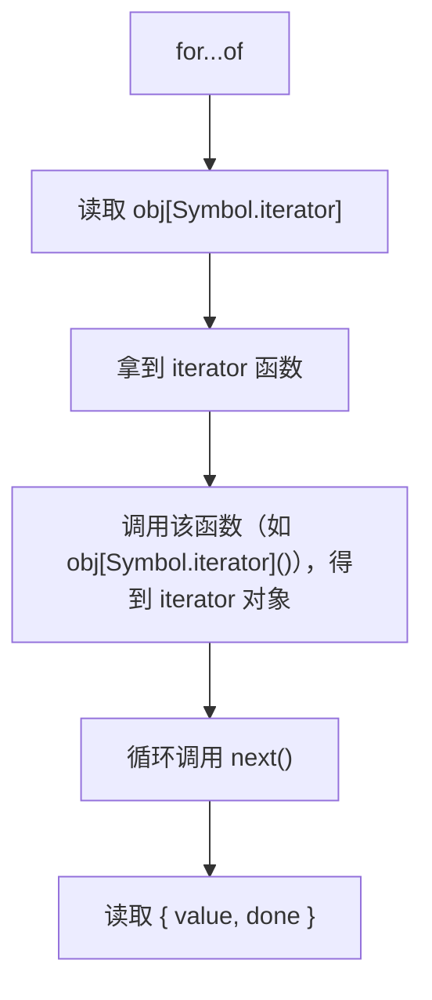
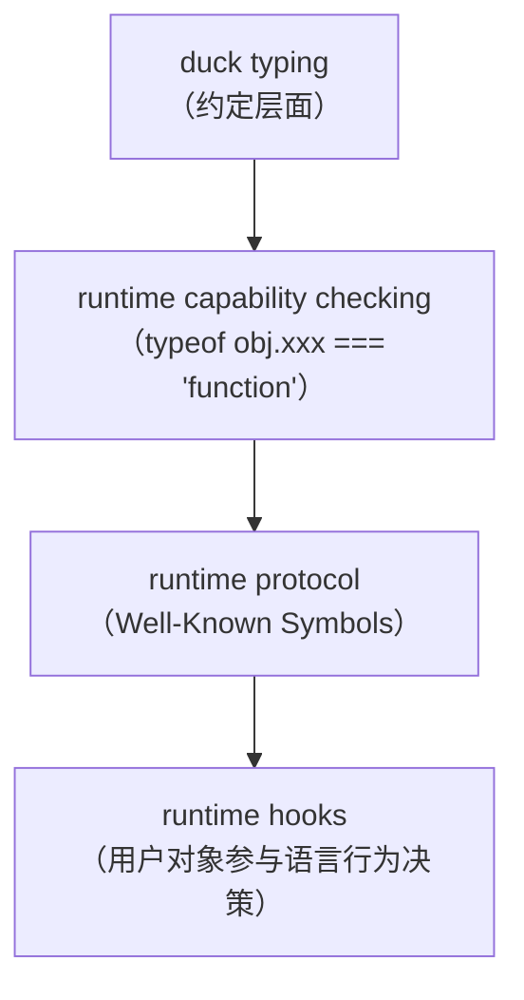

第一次学 `Symbol`，脑子里留下的通常是这几个事实：

- `Symbol() !== Symbol()`
- 能当对象 key
- `Object.keys()` 拿不到
- 可以"防止属性冲突"
- 内置了 `Symbol.iterator`、`Symbol.toPrimitive`、`Symbol.asyncIterator` 等 well-known symbol

这些都没错，但学完总觉得哪里不对：它既不像数组、Promise 那样直接解决业务问题，也不像 class、模块化那样能改变代码组织方式。所以会有"知道它是什么，但不知道它为什么存在"的感觉。

要理解 Symbol 为什么重要，不能只把它当成一种"特殊属性名"，得再往下追问：

> **JavaScript 到底是如何判断一个对象是否具备某种能力的？**

Symbol 给这个问题提供了一个统一的答案。

但想理解为什么非得搞一个新机制，得先想一个更基础的问题：

> **OOP 语言通常怎么让不同的对象去响应同一个调用？**

简单说，就是多态。

---

## 多态：OOP 的真正核心

OOP 之前，大型软件靠全局变量加散落的函数组织，项目一大改一处崩一片。

OOP 用三个承诺解决这个问题：

1. **封装**——数据和方法打包在一起，外部不能随意改内部状态
2. **继承**——共性提到父类，子类自动复用
3. **多态**——调用方只依赖行为接口，而不依赖具体实现

前两个主要解决代码组织问题，多态解决的是依赖关系问题。

真正重要的不是 `class` 本身，而是调用方能在不知道具体实现的情况下调用行为。这就是多态的核心价值。

举个例子。你设计一个动物园系统，调用方关心的是"这个动物能移动"，这是行为接口。至于猫是跑的、鸟是飞的、鱼是游的，这些是具体实现，调用方完全不关心。

多态要做的就是：调用方只依赖"能移动"，而不依赖"怎么移动"。

传统 OOP 靠**类型系统 + 继承体系**实现这一点。你必须先声明关系，编译器才放行：

```java
interface Animal {
    void move();
}

class Cat implements Animal {
    public void move() { System.out.println("猫在跑"); }
}

class Bird implements Animal {
    public void move() { System.out.println("鸟在飞"); }
}

void letItMove(Animal animal) {
    animal.move();
}

letItMove(new Cat()); // "猫在跑"
letItMove(new Bird()); // "鸟在飞"
```

`Cat` 和 `Bird` 都声明了"我是 `Animal`"，所以编译器允许它们作为参数传入 `letItMove`。

这叫 **nominal typing（名义类型）**——"你是谁"决定"你能做什么"。（TypeScript 也有 interface，但机制不同，见附录。）

---

## JavaScript 走了另一条路

JavaScript 长期以来用的是开放对象模型，偏基于行为而非基于类型。

它通常不关心你是谁、继承自谁、是否显式声明实现了某个接口。

它更关心：

> 你是否提供了某种行为。

也就是 **duck typing**：

> "如果它走起来像鸭子，叫起来像鸭子，那它就是鸭子。"

同样是 `animal.move()`，JavaScript 根本不需要 `interface Animal`：

```javascript
function letItMove(animal) {
  animal.move();
}

const cat = { move() { console.log('猫在跑'); } };
const bird = { move() { console.log('鸟在飞'); } };

letItMove(cat);
letItMove(bird);
```

不关心它有没有 `implements Animal`，不关心有没有继承，只关心一件事：它有没有 `move()`。

于是判断逻辑变成了"你能做什么"决定 runtime 怎么对待你，而不是"你是谁"。

这也是为什么很多 JavaScript API 都在做这种能力检查：

```javascript
if (typeof obj.xxx === 'function')
```

这个思路看起来很好，直到 runtime 自己也需要检测对象能力。

## 问题来了

duck typing 在用户代码层面很好用：直接调 `animal.move()`，简洁又灵活。

但 JavaScript 不只是用户代码在做能力检测——**runtime 自己也要检测**。

看这个例子：

```javascript
for (const x of obj) {
  console.log(x);
}
```

JavaScript 怎么知道 `obj` 能不能被 `for...of`？

你可能会说"因为它是数组"，但其实不是。下面这个对象也可以：

```javascript
const obj = {
  *[Symbol.iterator]() {
    yield 1;
    yield 2;
  }
};

console.log([...obj]); // [1, 2]
```

它既不是数组（`Array.isArray(obj)` 返回 false），也没继承 Array，但 runtime 依然允许它参与 `for...of`、展开运算符 `...`、`yield*`、`Array.from()`。

因为 JavaScript 不关心是 Array、Set、Map、Generator 还是自定义 class，只关心一件事：你能不能迭代。

对于 `for (const x of obj) {}`，runtime 必须判断"这个对象能不能被迭代"，于是它会去检查 `obj[Symbol.iterator]` 是否存在且是函数：

```javascript
typeof obj[Symbol.iterator] === 'function'
```

如果满足，对象就被视为 iterable。

到这里，duck typing 被推进成了语言级协议系统。

---

## 为什么字符串不够用？

你可能会想：直接用字符串不就行了？

```javascript
obj.iterator()
```

或者：

```javascript
typeof obj.iterator === 'function'
```

看起来够了，但问题在于 JavaScript 的对象模型是开放的。

---

## 开放对象模型

在 JavaScript 里，`obj.anything = 123` 永远成立。对象没有固定结构，可以随时动态扩展，所有属性共享同一个字符串命名空间。

比如：

```javascript
const user = {};
user.name = 'seven';
user.age = 18;
user.fetch = fn;
user.iterator = xxx;
```

这意味着 JavaScript 需要让"用户属性"和"语言协议"共享同一个对象空间，这本身就有矛盾。

---

## 核心矛盾

JavaScript 想同时保留两件事：

1. **开放对象模型**：任何对象都能动态扩展（`obj.anything = 123`）
2. **可扩展的语言协议**：用户自己定义的对象也能参与 `for...of`、`+obj`、`instanceof`、`match`、`await` 这些 runtime 行为

问题是：runtime 必须稳定识别"这个对象有没有实现某种能力"，但 runtime protocol 和业务字段共享同一个字符串空间。冲突迟早会发生。

---

## 如果 runtime protocol 用字符串会怎样？

假设 JavaScript 规定 `obj.iterator()` 就是 iterable protocol，那业务代码完全可能这样写：

```javascript
obj.iterator = fetchNextPage;
```

现在 runtime 已经无法分辨这个 `iterator` 到底是语言协议入口还是普通业务字段。这不是代码风格问题，是 JavaScript 对象模型本身的结构问题。

更危险的是，这会让 JavaScript runtime 失去安全扩展能力。每新增一个协议——`iterator`、`matcher`、`primitiveConverter`、`dispose`、`observable`——都可能撞上业务字段。runtime 和业务代码永远在争抢同一个字符串空间，语言演化会越来越脆弱。

## 为什么别的方案不行？

### 方案一：改成 class/interface

像 Java 那样 `implements Iterable`？

问题在于 JavaScript 本身不是 nominal typing。它不想要求"你必须属于某个类型"，它想表达的是：只要你实现了这个行为，你就能参与这个协议。这正是 duck typing 的核心。

interface / nominal typing 路线和 JavaScript 长期坚持的开放对象模型、鸭子类型传统对不上。

---

### 方案二：把协议入口藏进引擎内部

那能不能用引擎内部的私有 slot 来做协议入口呢？

不能。像 `[[DateValue]]` 这样的 slot，可以理解成出厂焊死的存储格，只能由引擎在 C++ 层读写，JS 代码碰不到。如果协议入口放在这样的 slot 里（比如 `[[Iterator]]`），用户就完全没法在 JS 层面自行实现。

那能不能像 `[[Prototype]]` 那样，专门暴露一个 JS API（比如设计成 `Object.setIterator(obj,fn)` 在 runtime 读取 `[[IteratorMethod]]`）？技术上并非不可行，但这会引入一套游离于普通属性系统之外的特殊机制，使协议能力无法像普通属性那样参与继承、代理、反射与对象组合，这与 JavaScript 一贯强调的开放对象模型并不一致。

而 JavaScript 的核心要求是：协议必须对用户完全开放，你自己的对象也要能像内置对象一样自然地参与 `for...of`。

所以协议入口需要同时满足三个条件：

1. runtime 能稳定识别
2. 用户能够自行实现
3. 不会与普通字段发生冲突

字符串属性满足不了第三点。内部槽满足不了第二点。

在保持 JavaScript 现有对象模型和开放扩展能力的前提下，引入一套独立的属性标识空间，是个自然且代价较低的方案。

Symbol 就是在这个背景下被引入的。它能作为对象属性使用，又不和字符串属性共享命名空间，同时保留了原型链、属性描述符、Proxy 等对象机制。

---

## Runtime Protocol 落地：for...of 到底做了什么？

现在看一个协议在运行时到底怎么运作。

`for (const x of obj)` 触发迭代，runtime 的实际检查过程：



关键点：**runtime 根本不关心 obj 的具体类型**，只检查 `obj[Symbol.iterator]` 是否存在且是函数。

这就是语言级 duck typing——不是靠编译器在编译期做类型匹配，而是 runtime 在运行时做能力检查。

用一个最小实验来印证：

```javascript
const obj = {
  *[Symbol.iterator]() {
    yield 1;
    yield 2;
  }
};

console.log([...obj]); // [1, 2]
```

第一次看到这里会觉得"只有数组才能展开"，但展开运算符真正检查的不是 `Array` 类型，而是 `obj[Symbol.iterator]`。

在 JavaScript 里，行为不由类型决定，而由协议决定。Symbol 让这个思想第一次在语言层面有了稳定、可扩展的实现机制。

---

## 一个容易混淆的边界：Symbol 不是协议本身

容易产生一个误解：`Symbol.iterator` 就是迭代协议。

其实不是。`Symbol.iterator` 只是协议的入口标识，一个稳定的 key，告诉 runtime "去这个位置找迭代能力"。真正的协议还要规定找到入口之后的行为契约：调用它必须返回一个对象，这个对象必须有 `next()` 方法，`next()` 必须返回 `{ done, value }`，如此反复直到 `done` 为 `true`。

规范里这其实是两层：Iterable Protocol（对象怎么暴露迭代入口）和 Iterator Protocol（迭代器本身怎么吐值）。`Symbol.iterator` 只参与第一层定位入口；第二层的结构契约完全由规范文字定义，跟 Symbol 无关。

所以 Symbol 解决的是"协议入口怎么稳定定位、不会撞名"，而"协议本身长什么样"是另一回事，靠规范对结构的规定。把这个边界分清，才不会把 Symbol 和 protocol 混为一谈。

---

## Runtime Hooks

理解了 `Symbol.iterator`，会发现 JavaScript 做了一件事：把部分原本由语言内部决定的行为，通过协议入口开放给用户对象。用户对象开始能参与语言行为的决策。

这类协议入口可以理解成：

> runtime hooks

### 对象为什么能参与 `+obj`

```javascript
const obj = {
  [Symbol.toPrimitive]() {
    return 123;
  }
};

console.log(+obj); // 123
```

runtime 检查 `obj[Symbol.toPrimitive]`，把"如何转换为原始值"这个内部决策权交给了对象自己。

### `instanceof` 为什么能被改写

```javascript
class MyArray {
  static [Symbol.hasInstance](value) {
    return Array.isArray(value);
  }
}

[] instanceof MyArray; // true
```

runtime 检查 `Ctor[Symbol.hasInstance]`，连 `instanceof` 的判定逻辑都变成可插拔的。

### 正则匹配也能被 hook

```javascript
const matcher = {
  [Symbol.match](str) {
    return ['custom'];
  }
};

console.log('hello'.match(matcher));
```

`String.prototype.match` 不再是铁板一块——只要对象实现了 `Symbol.match`，它就能接入 `match` 这个语言行为。

---

### 设计意图

这些能力靠的是 Symbol 的三个特性：

- **唯一性**：协议入口不会因字符串同名撞车。`Symbol('id') !== Symbol('id')`，每次调用都是新值，identity 就是这个值本身，不是描述字符串。
- **独立命名空间**：协议入口和业务字段共存。对象 key 从 `string` 扩展为 `string | symbol`，两套体系互不冲突。
- **默认跳过普通枚举**：协议不污染数据空间。`Object.keys()`、`for...in` 只枚举字符串 key，自动忽略 symbol-keyed 属性。但它们并非隐藏，`Reflect.ownKeys()` 或 `Object.getOwnPropertySymbols()` 仍能拿到。这些属性承载的是运行时钩子，不是业务数据。

三条合在一起，就是一个运行时能稳定依赖、用户能自由实现、业务代码不会意外撞上的协议系统。迭代器是第一个落地的案例，后面还有异步迭代器、原始值转换、正则匹配钩子、instanceof 钩子，以及更晚的 `Symbol.dispose`、`Symbol.asyncDispose`。整条路线都建在这个机制上。

---

## Symbol：JavaScript 扩展语言能力的另一条路

Symbol 不只是多了一种属性 key，它还改变了 JavaScript 扩展语言能力的方式。

可以把这条演化路线概括成：



最早的 JavaScript 更依赖 duck typing。

对象有没有某种能力，通常靠约定好的字符串字段判断：

```javascript
if (typeof obj.move === 'function') {
    ...
}
```

这种方式简单灵活，但有几个问题：

* runtime 无法稳定依赖这些约定
* 协议入口容易和业务字段冲突
* 每新增一种能力，语言和业务代码还得继续共享同一个字符串命名空间

Symbol 给 JavaScript 提供了一套独立的协议标识空间。运行时开始能通过：

```javascript
obj[WellKnownSymbol]
```

稳定地发现对象实现的能力，而用户也能够像内置对象一样参与这些协议。

例如：

* `Symbol.iterator`
* `Symbol.toPrimitive`
* `Symbol.hasInstance`
* ...

这些协议入口让原本由语言内部决定的行为，开始向用户对象开放。

JavaScript 扩展语言能力，以前靠新增语法或新增内置对象，现在多了一条路：通过运行时协议扩展语言行为。迭代器是第一批落地案例。

更关键的是，Symbol 让 JavaScript 第一次有了一套运行时可稳定识别、用户可自由实现、又不会和业务代码冲突的协议机制。

---

## 一个值得长期思考的问题

如果 JavaScript 从一开始就是强 nominal type system，它还会需要 Symbol 吗？Symbol 会不会本质上是动态语言为了"开放协议扩展"而付出的复杂度？

这个问题一路牵出 TypeScript 为什么存在、Rust trait 和 interface 的区别、动态语言和静态语言的边界。Symbol 只是这条演化路线上的一个节点。

## 附录：Symbol 基础 API

前面讲的是 Symbol 为什么存在，这部分是 API 速查，可以跳过。

### 创建 Symbol

最基本的方式是调用 `Symbol()`：

```javascript
const a = Symbol("foo");
const b = Symbol("foo");

console.log(a === b); // false
```

描述字符串只是给人看的调试信息，不参与 identity。

```javascript
console.log(a.description); // "foo"
console.log(String(a));     // "Symbol(foo)"
```

记住两件事：

* 描述相同 ≠ 值相同
* `Symbol` 不是构造函数，**不能 `new`**

```javascript
new Symbol("foo"); // ❌ TypeError
```

---

### Symbol.for()：共享 Symbol

如果希望**同一个 key 永远拿到同一个 Symbol**，可以使用 `Symbol.for()`。

它会查找当前 JavaScript Agent 关联的全局 Symbol 注册表，如果存在对应 key，就直接返回原来的 Symbol，否则创建一个新的并登记进去。

```javascript
Symbol.for("foo") === Symbol.for("foo");
// true
```

可以通过 `Symbol.keyFor()` 反查注册 key：

```javascript
Symbol.keyFor(Symbol.for("foo"));
// "foo"

Symbol.keyFor(Symbol("foo"));
// undefined
```

两者区别主要在 identity 由谁决定：

普通 Symbol：

```javascript
Symbol("id");
Symbol("id");
```

每次都会创建新的唯一值。

identity 就是这个值本身。

共享 Symbol：

```javascript
Symbol.for("id");
```

identity 由注册表里的 key 决定，相同 key 总返回同一个值。

因此 `Symbol.for()` 更适合：

* 跨模块共享协议
* 框架内部约定
* 全局能力标识

普通业务场景优先使用 `Symbol()` 即可。

---

### Symbol 作为对象属性 Key

Symbol 最常见的用途，就是作为对象属性名。

```javascript
const id = Symbol();

const user = {
    [id]: 123
};

console.log(user[id]); // 123
```

注意：必须使用中括号访问。

```javascript
user.id; // undefined

user[id]; // 123
```

因为：

```javascript
user.id
```

等价于：

```javascript
user["id"]
```

它访问的是字符串 `"id"`，不是 Symbol。

---

### Symbol 属性默认不会参与普通枚举

Symbol 属性不会出现在：

```javascript
Object.keys(obj);

for (const key in obj) {}

JSON.stringify(obj);
```

例如：

```javascript
const id = Symbol();

const obj = {
    [id]: 1,
    name: "seven"
};

Object.keys(obj);
// ["name"]

JSON.stringify(obj);
// {"name":"seven"}
```

但 Symbol 属性并不是隐藏属性。

可以通过：

```javascript
Object.getOwnPropertySymbols(obj);
```

获取对象自身所有 Symbol 属性。

```javascript
Object.getOwnPropertySymbols(obj);
// [Symbol()]
```

如果想同时获取字符串和 Symbol 属性，可以使用：

```javascript
Reflect.ownKeys(obj);
```

```javascript
Reflect.ownKeys(obj);

// ["name", Symbol()]
```

---

### Symbol 不允许隐式转换

Symbol 没有合理的数值语义，JavaScript 禁止它参与隐式字符串和数字转换。

```javascript
+Symbol();

// ❌ TypeError
```

```javascript
"" + Symbol();

// ❌ TypeError
```

如果只是打印，可以显式转换：

```javascript
String(Symbol("foo"));
// "Symbol(foo)"
```

```javascript
Symbol("foo").toString();
// "Symbol(foo)"
```

通常推荐：

```javascript
String(value);
```

更通用，也能处理 `null`、`undefined` 等值。

Symbol 不能转换成 Number。

```javascript
Number(Symbol());

// ❌ TypeError
```

确保 Symbol 不进入数学计算即可。

---

### 常见 Well-known Symbols

除了自己创建 Symbol，JavaScript 还内置了一批 Well-known Symbols，作为语言协议入口。

| Symbol                      | 用途                       |
| --------------------------- | ------------------------ |
| `Symbol.iterator`           | `for...of`、展开运算符         |
| `Symbol.asyncIterator`      | `for await...of`         |
| `Symbol.toPrimitive`        | 类型转换                     |
| `Symbol.hasInstance`        | `instanceof` 判定          |
| `Symbol.match`              | `String.prototype.match` |
| `Symbol.replace`            | `replace`                |
| `Symbol.search`             | `search`                 |
| `Symbol.split`              | `split`                  |
| `Symbol.isConcatSpreadable` | `concat` 展开行为            |
| `Symbol.species`            | 派生对象构造                   |
| `Symbol.toStringTag`        | 自定义类型标签                  |
| `Symbol.dispose`            | `using` 资源释放             |
| `Symbol.asyncDispose`       | 异步资源释放                   |

本文重点讨论的是这类 Symbol。

它们不是协议本身，而是协议的**稳定入口标识**。

JavaScript runtime 通过这些 Symbol，发现对象实现了哪些能力；而用户对象也可以像内置对象一样，实现这些协议，参与语言行为。

## 附录：TypeScript 的 interface 和 Java 的 interface 不是一回事

Java 的 interface 是 **nominal typing**——你必须显式声明 `implements`，编译器才认：

```java
class Cat implements Animal { ... }  // 不写这句就不算
```

TypeScript 的 interface 是 **structural typing**——不看声明，只看结构是否匹配：

```typescript
interface Animal {
  move(): void;
}

const cat: Animal = { move() { console.log('猫在跑'); } };  // ✅ 没写 implements，结构对了就算
```

本质上是把 duck typing 搬到了编译期。

但这正好说明 interface 路线解决不了 JavaScript 的问题：Symbol 要解决的是 runtime 能力检测，代码已经跑起来了，没有编译器帮你做结构匹配。runtime 只能靠一个稳定的标识符去对象上找协议入口，这正是 Symbol 存在的理由。

打个比方：

**TypeScript 的 interface** 就像一个门卫，在你进大楼之前先查你的身份证。只要你结构长得对，他就放你进去。但他一下班（代码编译完开始运行），就没人查了。

**JavaScript 运行时** 就像是进去之后，大楼里的各种设施。比如有个"可迭代"通道，你必须刷卡才能过。但这个卡不能是一张写着你名字的普通名片（字符串），因为普通名片太容易伪造或和别人撞上。你需要一张**官方定义、身份唯一且稳定可识别的门禁卡。**

`Symbol.iterator` 就是这张官方门禁卡。

运行时一看你掏出了这张卡，就知道："哦，这个对象是支持迭代的，放行。"

如果没有 Symbol，只能用字符串当卡（比如 `obj.iterator`），那就会出问题：业务代码也可能给自己挂一个叫 `iterator` 的属性，和官方卡撞上。运行时根本分不清谁是官方的。