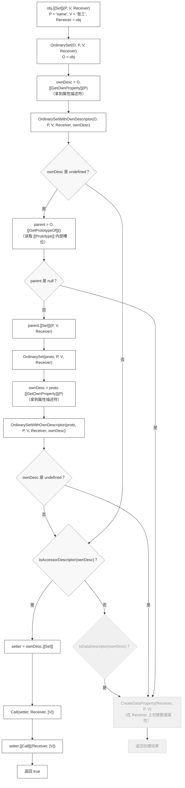
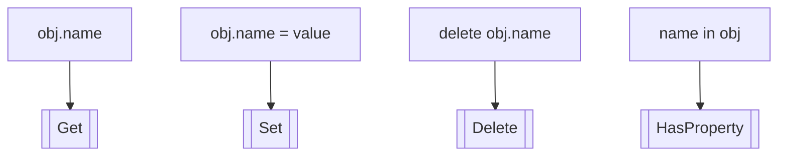
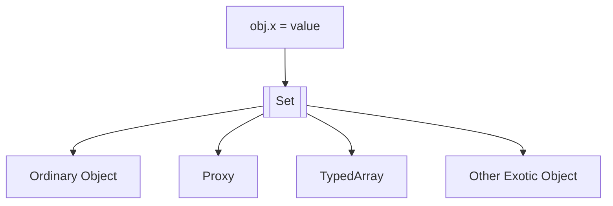
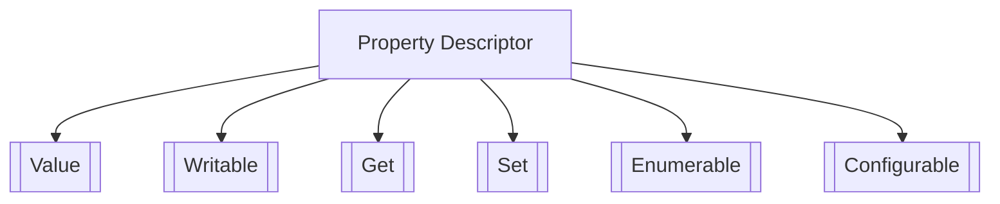
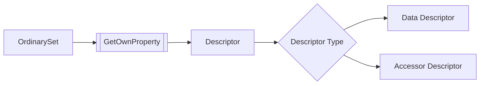
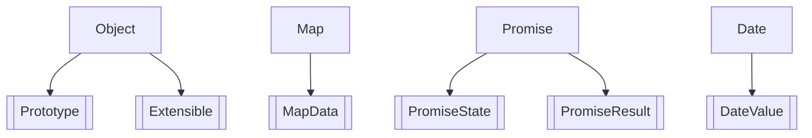

# 用一个例子，串起 ECMAScript 对象模型

## 一、现象：一条普通赋值，为什么会触发原型上的 setter？

```javascript
const proto = {
  set name(value) {
    console.log('setter:', value);
  },
};

const obj = Object.create(proto);

obj.name = '张三';
// setter: 张三
```

`obj` 自身并没有 `name` 属性。

然而，当执行：

```javascript
obj.name = '张三';
```

时，引擎并没有直接在 `obj` 上创建一个新的属性，而是沿着原型链找到了 `proto.name`。

由于它是一个**访问器属性（Accessor Property）**，最终执行了对应的 setter。

这个现象本身并不陌生。

真正值得追问的，并不是这次赋值经历了多少个步骤，而是：

> **为什么这样一条看似简单的赋值语句，会依次涉及对象、原型、属性描述符、setter 等一系列机制？**

换句话说，我们真正想理解的是：

> **ECMAScript 是如何组织对象行为的。**

本文将沿着这条赋值语句的执行路径，一步一步看看它经过了哪些角色，以及这些角色如何共同组成 ECMAScript 的对象模型。

## 二、上面这段代码，在规范里是什么样？



---

| 步骤 | 规范位置 | 条款 |
|------|----------|------|
| `[[Set]]` 调用 | 10.1.9 | [[Set]] ( propertyKey, value, receiver ) |
| `OrdinarySet` | 10.1.9.1 | OrdinarySet ( O, P, V, Receiver ) |
| `OrdinarySetWithOwnDescriptor` | 10.1.9.2 | OrdinarySetWithOwnDescriptor ( O, P, V, Receiver, ownDesc ) |
| `[[GetOwnProperty]]` | 10.1.5 | [[GetOwnProperty]] ( P )（其 OrdinaryGetOwnProperty 为 10.1.5.1）|
| `[[GetPrototypeOf]]` | 10.1.1 | [[GetPrototypeOf]] ( )（其 OrdinaryGetPrototypeOf 为 10.1.1.1）|
| `IsAccessorDescriptor` | 6.2.6.1 | IsAccessorDescriptor ( Desc ) |
| `IsDataDescriptor` | 6.2.6.2 | IsDataDescriptor ( Desc ) |
| `CreateDataProperty` | 7.3.5 | CreateDataProperty ( O, P, V ) |
| `Call` | 7.3.13 | Call ( func, thisValue [, argList ] ) |
| `[[Call]]` | 10.2.1 | [[Call]] ( thisArg, argList )（ECMAScript 函数对象；内置函数对象的 `[[Call]]` 为 10.3.1）|
| `OrdinaryDefineOwnProperty` | 10.1.6.1 | OrdinaryDefineOwnProperty ( O, P, Desc ) |

> 注：严格来说，赋值表达式 `obj.name = '张三'` 会先经过规范中的 `EvaluateAssignmentExpression` 求值（包括右侧表达式的 `GetValue` 和左侧引用的获取），然后由 `PutValue` 抽象操作调用对象的 `[[Set]]` 内部方法。
>
> 不过，这些步骤主要负责处理赋值表达式本身的语义（引用解析、环境记录分发等），与对象模型无关。因此后文直接从 `[[Set]]` 入口开始。
>
> 另外，`[[Set]]` 内部方法在规范中并非只有 `OrdinarySet` 这一种实现——Proxy、TypedArray、Module Namespace、Arguments 等奇异对象均有自己的 `[[Set]]` 定义。本章 `obj` 和 `proto` 均为普通对象，因此图中直接进入 `OrdinarySet` 路径。（注意：Array 虽然也是奇异对象，但它并没有自定义 `[[Set]]`，只在 `[[DefineOwnProperty]]` 上维护 `length`，赋值时仍走普通 `[[Set]]`。）
>
> 值得注意的一个细节是：在规范里，入口和实现的层级关系并不总是同一个方向。
> 对于属性赋值，入口是对象的内部方法 `[[Set]]`，它内部调用抽象操作 `OrdinarySet` 来完成实际逻辑。  
> 对于函数调用，入口是抽象操作 `Call`，它内部调用函数的内部方法 `[[Call]]` 来执行函数体。
> 两者都是“入口 → 实现”的两层结构，只是入口落在哪一层不同。这取决于规范是把“多态分发”放在外部，还是把“公共逻辑”放在外部。对象模型选择了前者，函数调用选择了后者。

> 补充一点：`OrdinarySet` 本身只有两步 —— 取 `[[GetOwnProperty]]`，再转交给 `OrdinarySetWithOwnDescriptor`。真正承载“原型链查找、描述符判断、调用 setter、创建属性”这些算法的，是后者。图中为了展示完整路径，将两者合并呈现。

---

第一次看到这张图，大多数人都会有一种感觉：

> **名字很多，而且几乎一个都不认识。**

例如：

```
[[Set]]
OrdinarySet
OrdinarySetWithOwnDescriptor
[[GetOwnProperty]]
[[GetPrototypeOf]]
OrdinaryDefineOwnProperty
IsAccessorDescriptor
IsDataDescriptor
Call
[[Call]]
[[Prototype]]
```

它们既不是 JavaScript 语法，也不是运行时提供的 API。

它们全部来自 ECMAScript 规范，用来描述：

> **当 JavaScript 引擎执行一段代码时，内部究竟发生了什么。**

不过，现在并不需要急着理解每一个名字。

先退一步观察，会发现它们其实并不是同一种东西，而是在整个执行过程中扮演着不同的角色。

例如：

| 类型                         | 例子                                                                                         |
| -------------------------- | ------------------------------------------------------------------------------------------ |
| Internal Method（内部方法）      | `[[Set]]`、`[[GetOwnProperty]]`、`[[GetPrototypeOf]]`、`[[Call]]`                             |
| Abstract Operation（抽象操作）   | `OrdinarySet`、OrdinarySetWithOwnDescriptor、`OrdinaryDefineOwnProperty`、`IsAccessorDescriptor`、`IsDataDescriptor`、`Call` |
| Property Descriptor（属性描述符） | `ownDesc`                                                                                  |
| Internal Slot（内部槽位）        | `[[Prototype]]`                                                                            |

如果把整张流程图看成一次旅行，那么这些名字并不是一串零散的站点，而是旅途中不断出现的几类角色。

例如：

* `[[Set]]` 接收一次属性赋值请求；
* `OrdinarySet` 负责执行普通对象的默认赋值算法；
* `ownDesc` 描述当前属性究竟是什么；
* `[[Prototype]]` 决定下一步应该去哪个对象继续查找。

整条执行路径，就是这些角色彼此协作的过程。

因此，接下来的内容也不会按照 ECMAScript 规范的章节顺序逐个解释这些术语，而是沿着这条赋值路径，依次认识它们在对象模型中的职责。

第一位出场的角色，就是对象如何响应一次操作。

---

## 三、对象如何响应一次操作：从 Internal Method 到 OrdinarySet

上一章，我们已经把：

```javascript
obj.name = "张三";
```

拆成了：

```text
obj.name = "张三"

↓

[[Set]]

↓

OrdinarySet
```

第一次读规范时，很多人都会产生一个疑问。

既然：

```text
OrdinarySet
```

已经负责完成属性赋值。

为什么规范还要设计一个：

```text
[[Set]]
```

或者换一种问法：

为什么不是：

```text
obj.name = "张三"

↓

OrdinarySet
```

直接结束？

ECMAScript 为什么要多出这一层？

要回答这个问题，需要先换一个角度理解对象。

---

### ECMAScript 是围绕操作来定义对象的

大多数 JavaScript 开发者会把对象理解成：

```text
对象

↓

保存 Property 的容器
```

例如：

```javascript
const obj = {
  name: "张三",
  age: 18,
};
```

看起来，对象就是：

```text
key

↓

value
```

的集合。

但在 ECMAScript 规范里，对象首先被定义成：

> **能够响应一组操作（Operations）的实体。**

对于规范来说：

```javascript
obj.name;
```

并不仅仅是：

> 读取一个属性。

而是：

```text
读取属性

↓

[[Get]]
```

同样：

```javascript
obj.name = "张三";
```

对应：

```text
设置属性

↓

[[Set]]
```

```javascript
delete obj.name;
```

对应：

```text
删除属性

↓

[[Delete]]
```

```javascript
"name" in obj;
```

对应：

```text
判断属性是否存在

↓

[[HasProperty]]
```

可以简单表示成：

```text
JavaScript Syntax

↓

Internal Method
```

或者：



因此：

> ECMAScript 并不是围绕“对象长什么样”组织对象模型，而是围绕“对象能够响应什么操作”组织对象模型。

这是理解整个对象模型最重要的前提之一。

---

### Internal Method：对象的操作接口

既然对象被定义成：

> 能够响应一组操作的实体。

那么规范就需要先回答：

> 一个对象至少应该支持哪些操作？

于是 ECMAScript 定义了一组：

```text
Internal Method（内部方法）
```

例如：

```text
[[Get]]
[[Set]]
[[Delete]]
[[HasProperty]]
[[GetOwnProperty]]
[[DefineOwnProperty]]
[[GetPrototypeOf]]
[[SetPrototypeOf]]
```

这些方法并不是：

```javascript
obj.[[Set]]()
```

这种可以直接调用的 JavaScript API。

它们属于：

> **ECMAScript 规范中的抽象操作接口。**

它们描述的是：

> 一个对象应该能够响应什么行为。

例如：

```text
[[Set]]
```

并不关心：

> 属性应该如何写入。

它只规定：

> 对象需要支持“设置属性”这件事情。

同理：

```text
[[Get]]
```

也不关心：

> 属性应该如何读取。

它只规定：

> 对象需要支持“读取属性”这件事情。

因此可以把 Internal Method 理解成：

> **对象行为的抽象接口。**

---

### 为什么需要 Internal Method？

现在回到最开始的问题。

为什么：

```text
obj.name = value

↓

[[Set]]

↓

OrdinarySet
```

而不是：

```text
obj.name = value

↓

OrdinarySet
```

原因在于：

> 同一句 JavaScript，在不同对象上可能意味着完全不同的行为。

例如：

普通对象：

```javascript
const obj = {};
obj.x = 1;
```

意味着：

```text
创建属性
```

Proxy：

```javascript
proxy.x = 1;
```

意味着：

```text
触发 set trap
```

TypedArray：

```javascript
ta[100] = 1;
```

意味着：

```text
边界检查

↓

数值转换

↓

写入底层 Buffer
```

而：

```javascript
Object.preventExtensions(obj);
obj.x = 1;
```

又可能意味着：

```text
赋值失败
```

同一句：

```javascript
obj.x = value
```

背后存在完全不同的语义。

如果规范直接写：

```text
obj.x = value

↓

OrdinarySet
```

那么：

Proxy 怎么办？

TypedArray 怎么办？

未来新的对象类型怎么办？

规范总不能这样：

```text
if OrdinaryObject

if Proxy

if TypedArray

if ...
```

把所有对象类型全部硬编码进去。

于是 ECMAScript 采用了另一种设计：

> **语言只发出同一个请求：`[[Set]]`。**

至于如何响应：

由对象自己决定。

```text
obj.x = value

↓

[[Set]]

↓

对象自己的实现
```

这就是：

> **行为多态（Polymorphism）。**

---

### 同一个 `[[Set]]`，不同对象可以有不同实现

可以把整个过程理解成：



对于 ECMAScript 来说：

```text
[[Set]]
```

是一种统一的操作协议。

所有对象都需要支持：

```text
设置属性
```

但如何完成：

```text
设置属性
```

则是对象自己的事情。

例如：

普通对象：

```text
OrdinaryObject.[[Set]]

↓

OrdinarySet
```

Proxy：

```text
Proxy.[[Set]]

↓

set trap
```

TypedArray：

```text
TypedArray.[[Set]]

↓

Integer Indexed Element Set
```

因此：

> Internal Method 解决的并不是如何实现行为，而是如何统一描述行为。

---

### `[[Set]]` 与 `OrdinarySet` 的关系

到这里，我们终于可以回答最开始的问题：

为什么同时存在：

```text
[[Set]]
```

和：

```text
OrdinarySet
```

因为它们的职责完全不同。

```text
[[Set]]

↓

定义对象应该支持什么行为
```

而：

```text
OrdinarySet

↓

定义普通对象如何完成这种行为
```

可以简单画成：

```mermaid
flowchart TD

A[[Set]]

B[OrdinarySet]

C[Proxy.[[Set]]]

D[TypedArray.[[Set]]]

A --> B
A --> C
A --> D
```

如果借用面向对象里的概念：

```text
Internal Method

↓

接口（Interface）

Ordinary Algorithm

↓

默认实现（Default Implementation）
```

当然，ECMAScript 规范并不是面向对象框架。

这里只是为了帮助理解它们之间的关系。

因此：

> `[[Set]]` 回答的是：“对象应该能够做什么。”

而：

> `OrdinarySet` 回答的是：“普通对象应该如何完成这件事情。”

---

### Ordinary Object 与 Exotic Object

既然：

```text
[[Set]]
```

允许对象拥有自己的实现。

那么规范自然会出现两类对象。

第一类：

> Ordinary Object（普通对象）

例如：

```javascript
{}
[]
function () {}
```

它们的大多数 Internal Method 都采用规范提供的默认实现。

例如：

```text
OrdinaryObject.[[Set]]

↓

OrdinarySet
```

第二类：

> Exotic Object（异质对象）

它们会重写某些 Internal Method。

例如：

Proxy：

```text
Proxy.[[Set]]

↓

set trap
```

TypedArray：

```text
TypedArray.[[Get]]

TypedArray.[[Set]]
```

都拥有特殊实现。

需要注意的是：

> Exotic Object 并不意味着所有 Internal Method 都被重写。

例如：

Array 虽然属于 Exotic Object。

但：

```text
Array.[[Set]]

↓

OrdinarySet
```

仍然使用普通对象的赋值算法。

它真正特殊的地方在：

```text
[[DefineOwnProperty]]
```

与：

```text
length
```

的联动行为。

因此：

> Ordinary Object 与 Exotic Object 的区别，不在于是否拥有 Internal Method，而在于是否重写了某些 Internal Method 的默认实现。

---

### 下一站：Property Descriptor

到这里，我们已经认识了对象模型中的第一块拼图：

```text
Internal Method
```

它回答的问题是：

> **对象如何响应一次操作（Behavior）。**

但是：

```text
OrdinarySet
```

收到赋值请求以后，并不会立刻修改对象。

它首先需要知道：

> 当前这个 Property 究竟是什么？

它是：

```text
数据属性？

访问器属性？

根本不存在？
```

这些信息并不保存在：

```text
[[Set]]
```

之中。

而是保存在另一种结构：

```text
Property Descriptor
```

于是：

```text
obj.name = "张三"

↓

[[Set]]

↓

OrdinarySet

↓

[[GetOwnProperty]]

↓

Property Descriptor
```

下一章，我们继续沿着这条赋值路径往下走，看看：

> **ECMAScript 为什么需要先描述 Property 的语义，再决定如何完成一次赋值。**

---

## 四、Property Descriptor：Property 的语义是如何被描述的

上一章，我们已经知道：

```text
obj.name = "张三"

↓

[[Set]]

↓

OrdinarySet(O, P, V, Receiver)
```

但 `OrdinarySet` 收到赋值请求以后，并没有立刻修改对象。

它做的第一件事情是：

```text
ownDesc = O.[[GetOwnProperty]](P)
```

这里有一个很容易被忽略的细节。

如果只是想给 `name` 赋值，我们似乎只需要知道：

```javascript
obj.name
// "张三"
```

或者：

```javascript
obj.name
// undefined
```

就够了。

可规范并没有直接取得 Property 的值，而是先取得了一个叫做：

```text
ownDesc
```

的东西。

它既不是：

```javascript
"张三"
```

也不是：

```javascript
undefined
```

而是：

> **Property Descriptor（属性描述符）。**

为什么会多出这一层？

ECMAScript 为什么不直接操作 Property，而要先拿到一份 Descriptor？

要回答这个问题，需要先问另一个更根本的问题：

> **对于 ECMAScript 来说，一个 Property 究竟是什么？**

---

### 为什么 Property 需要一张说明书？

对于大多数 JavaScript 开发者来说，一个 Property 往往可以理解成：

```text
name → value
```

例如：

```javascript
const obj = {
  name: "张三",
};
```

这里的：

```text
name
```

对应：

```text
"张三"
```

这种理解对于日常开发已经足够。

但站在 ECMAScript 规范的角度，它并不完整。

例如：

```javascript
const obj = {
  get name() {
    return "张三";
  },
};
```

这里的 `name` 并没有保存任何值。

读取它时：

```javascript
obj.name;
```

真正发生的是：

```text
执行 getter

↓

返回 "张三"
```

再例如：

```javascript
Object.defineProperty(obj, "name", {
  value: "张三",
  writable: false,
  enumerable: false,
  configurable: false,
});
```

这个 Property 除了值以外，还包含：

* 是否允许写入；
* 是否参与枚举；
* 是否允许重新定义。

这些信息都会影响 Property 的行为。

因此，对于 ECMAScript 来说：

> **Property 并不仅仅是一个值，而是一组语义（Semantics）的集合。**

它需要描述：

```text
保存什么数据？

是否允许写入？

是否允许枚举？

是否允许删除或重新定义？

它保存的是数据，还是 getter / setter？
```

只有先回答这些问题，算法才能决定：

> **应该如何处理这个 Property。**

于是，规范引入了一种专门描述 Property 的记录结构：

> **Property Descriptor（属性描述符）。**

可以把它理解成：

> **Property 的元信息（Metadata），或者说 Property 的一张说明书。**

算法真正处理的，并不是 Property 的值本身，而是这张说明书。

---

### Property Descriptor 长什么样？

规范中的 Property Descriptor 可以理解成一份记录（Record）。

它可能包含下面这些字段：

```text
[[Value]]
[[Writable]]

[[Get]]
[[Set]]

[[Enumerable]]
[[Configurable]]
```

需要注意两件事情。

第一，它不是 JavaScript 对象。

第二，它不会同时拥有所有字段。

规范会根据字段的不同组合，描述不同类型的 Property。

例如：



这些字段共同决定了：

> **一个 Property 应该表现出什么行为。**

---

### Property Descriptor 的两种形态

规范把 Property Descriptor 分成两类。

### Data Descriptor

最常见的是数据属性（Data Property）。

例如：

```javascript
const obj = {
  name: "张三",
};
```

规范中，它对应的 Descriptor 大致可以理解成：

```text
{
  [[Value]]: "张三",
  [[Writable]]: true,
  [[Enumerable]]: true,
  [[Configurable]]: true
}
```

它保存的是：

* 属性的值；
* 是否允许修改；
* 是否参与枚举；
* 是否允许重新定义。

它描述的是：

> **一个保存数据的 Property。**

---

#### Accessor Descriptor

另一类是访问器属性（Accessor Property）。

例如：

```javascript
const proto = {
  set name(value) {
    console.log(value);
  },
};
```

对应的 Descriptor 可以理解成：

```text
{
  [[Get]]: undefined,
  [[Set]]: setterFunction,
  [[Enumerable]]: true,
  [[Configurable]]: true
}
```

和 Data Descriptor 最大的区别在于：

```text
没有 [[Value]]

没有 [[Writable]]
```

取而代之的是：

```text
[[Get]]
[[Set]]
```

也就是说：

> **Accessor Property 不直接保存数据，而是保存一组读取和写入行为。**

因此：

```javascript
obj.name = "张三";
```

最终并不是：

```text
[[Value]] = "张三"
```

而是：

```text
Call(setter)
```

因为 Descriptor 中保存的不是：

```text
[[Value]]
```

而是：

```text
[[Set]]
```

指向的 setter 函数。

Vue 2 正是利用这一点，通过：

```javascript
Object.defineProperty()
```

给属性安装 getter 和 setter，在读取时收集依赖，在写入时通知更新。

从规范的角度看，这正是 Accessor Descriptor 的典型应用：

> **Property 保存的不再是数据，而是行为。**

---

### `OrdinarySet` 为什么先拿 Descriptor？

现在，再回到我们的赋值路径：

```text
OrdinarySet(O, P, V, Receiver)

↓

ownDesc = O.[[GetOwnProperty]](P)
```

为什么第一步不是直接赋值，而是先取得 Descriptor？

因为赋值算法必须先知道：

> **当前属性究竟具有什么语义。**

例如：



如果拿到的是：

```text
Data Descriptor
```

算法可能需要：

* 修改 `[[Value]]`；
* 检查 `[[Writable]]`；
* 创建新的数据属性。

如果拿到的是：

```text
Accessor Descriptor
```

算法则需要：

* 取得 `[[Set]]`；
* 调用 setter。

于是，第二章流程图里的：

```text
IsAccessorDescriptor(ownDesc)

IsDataDescriptor(ownDesc)
```

其实并不是在判断 Property 本身。

它们判断的是：

> **当前这个 Descriptor 描述的是哪一种 Property。**

因此可以说：

> `OrdinarySet` 并不是根据 Property 的名字和值做决策，而是根据 Property Descriptor 中记录的语义信息决定下一步行为。

也正因为如此，我们最开始那个例子：

```javascript
const proto = {
  set name(value) {
    console.log("setter:", value);
  },
};

const obj = Object.create(proto);

obj.name = "张三";
```

最终才能走到：

```text
Descriptor

↓

Accessor Descriptor

↓

[[Set]]

↓

Call(setter)
```

setter 的执行，并不是赋值语句的特殊规则。

它只是因为：

> **当前 Property 的 Descriptor 恰好描述了一个 Accessor Property。**

---

## 为什么 `Object.defineProperty()` 长这样？

很多开发者第一次接触：

```javascript
Object.defineProperty()
```

都会觉得它有点奇怪。

因为平时创建属性：

```javascript
obj.name = "张三";
```

只需要一个值。

而：

```javascript
Object.defineProperty(obj, "name", {
  value: "张三",
  writable: false,
  configurable: false,
  enumerable: false,
});
```

却需要传入一个包含各种字段的对象。

如果从 Property Descriptor 的角度来看，这种设计就很自然了。

因为：

```javascript
{
  value: "张三",
  writable: false,
  configurable: false,
  enumerable: false
}
```

本质上对应的是：

```text
Property Descriptor

↓

[[Value]]
[[Writable]]
[[Configurable]]
[[Enumerable]]
```

也就是说：

> `Object.defineProperty()` 的第三个参数，本质上就是 Property Descriptor 在 JavaScript 中的表示形式。

整个过程大致可以理解成：

```text
JavaScript Object

↓

ToPropertyDescriptor

↓

Property Descriptor

↓

[[DefineOwnProperty]]
```

规范会先读取对象中的：

```text
value
writable
get
set
enumerable
configurable
```

然后构造真正的 Property Descriptor。

随后再交给：

```text
[[DefineOwnProperty]]
```

完成属性定义。

因此：

> `Object.defineProperty()` 并没有发明一种新的属性系统。

它只是允许开发者直接参与构造 Property Descriptor。

从这个角度来看：

```javascript
obj.name = "张三";
```

属于语法糖。

而：

```javascript
Object.defineProperty()
```

则是在直接操作 Property 的语义。

---

### Descriptor 为什么不是 JavaScript 对象？

看到这里，一个疑问自然出现。

既然：

```javascript
Object.defineProperty(obj, "name", {
  value: "张三",
  writable: true,
});
```

中的第三个参数长得和 Descriptor 一模一样。

那为什么规范还要反复强调：

> Property Descriptor 不是 JavaScript 对象？

原因在于：

> Descriptor 属于 ECMAScript 规范，而对象属于 JavaScript 运行时。

它们处于两个不同层面。

例如：

```text
Property Descriptor
```

属于规范中的一种：

```text
Record
```

它是一种抽象记录结构。

类似于：

```text
Completion Record

Environment Record

Module Record
```

这些东西都存在于规范里。

JavaScript 代码无法直接访问。

例如：

```text
[[GetOwnProperty]]
```

返回的其实就是 Property Descriptor。

但你无法这样写：

```javascript
const desc = obj.[[GetOwnProperty]]("name");
```

因为：

```text
[[GetOwnProperty]]
```

根本不是 JavaScript API。

同样：

```text
Property Descriptor
```

也不会直接暴露给开发者。

开发者能够拿到的只有：

```javascript
Object.getOwnPropertyDescriptor(obj, "name");
```

返回的普通对象。

例如：

```javascript
{
  value: "张三",
  writable: true,
  enumerable: true,
  configurable: true
}
```

它和规范里的 Descriptor 描述的是同一份信息。

但它们不是同一个东西。

关系更接近于：

```text
Property Descriptor

↓

JavaScript Representation
```

或者：

```text
规范模型

↓

运行时映射
```

---

### Descriptor 是对象模型中的哪一层？

现在再回头看第二章那张流程图：

```text
OrdinarySet

↓

[[GetOwnProperty]]

↓

ownDesc

↓

IsAccessorDescriptor

↓

IsDataDescriptor
```

会发现：

Descriptor 的职责其实非常单纯。

它只回答一个问题：

> **当前 Property 具有什么语义？**

例如：

```text
这个属性能不能写？

是否可枚举？

是否可重新定义？

它保存的是值还是 getter / setter？
```

这些都属于 Property 自身。

而 Descriptor 负责把这些语义组织起来。

如果借用前面已经出现过的视角：

```text
对象如何响应操作？
```

是 Internal Method 负责的。

而：

```text
属性究竟是什么？
```

则是 Property Descriptor 负责的。

因此可以把 Descriptor 看成：

> **Property 与算法之间的一层中介。**

算法并不直接研究 Property。

算法研究的是：

```text
Property Descriptor
```

然后根据其中记录的语义决定下一步行为。

---

### 回到最开始那个 setter

现在，我们终于可以重新审视最开始那段代码。

```javascript
const proto = {
  set name(value) {
    console.log("setter:", value);
  },
};

const obj = Object.create(proto);
```

执行：

```javascript
obj.name = "张三";
```

时：

```text
OrdinarySet
```

先在当前对象上执行：

```text
[[GetOwnProperty]]
```

结果得到：

```text
undefined
```

于是继续沿原型链查找。

随后在：

```text
proto
```

上取得：

```text
Property Descriptor
```

大致为：

```text
{
  [[Get]]: undefined,
  [[Set]]: setterFunction,
  [[Enumerable]]: true,
  [[Configurable]]: true
}
```

接下来：

```text
IsAccessorDescriptor
```

返回：

```text
true
```

于是执行：

```text
Call(setter)
```

最终输出：

```text
setter: 张三
```

从头到尾，赋值算法并不知道：

```text
name
```

这个属性应该执行 setter。

它只是不断读取 Descriptor。

然后根据 Descriptor 中记录的语义做出决策。

因此：

> setter 并不是赋值语句的特殊规则。

而只是 Accessor Descriptor 被赋值算法自然解释后的结果。

---

### 下一站：Internal Slot

到这里，我们已经知道：

> Property 的语义由 Property Descriptor 描述。

但是最开始那段代码还有最后一个问题没有解释。

```javascript
const obj = Object.create(proto);

obj.name = "张三";
```

当前对象明明没有：

```text
name
```

为什么：

```text
[[GetOwnProperty]]

↓

undefined
```

以后，

赋值算法却知道应该继续去：

```text
proto
```

查找？

Property Descriptor 已经回答了：

> 一个 Property 是什么。

但它回答不了：

> 一个对象和另一个对象是什么关系。

真正保存这种关系的，并不是 Property。

而是对象内部另一类成员：

```text
[[Prototype]]
```

它不是 Property。

也不是 Descriptor。

而是对象内部状态的一部分。

在 ECMAScript 中，这类状态统一保存在：

```text
Internal Slot
```

之中。

如果说 Property Descriptor 描述的是：

> 属性具有什么语义。

那么 Internal Slot 保存的则是：

> 对象自身处于什么状态。

下一章，我们继续沿着这条赋值路径往下走，看看对象真正保存内部状态的地方。

---

## 五、Internal Slot：对象除了 Property，还保存着什么？

上一章，我们已经知道：

```text
OrdinarySet(O, P, V, Receiver)

↓

ownDesc = O.[[GetOwnProperty]](P)
```


但最开始那段代码，还有最后一个问题没有解释。

```javascript
const proto = {
  set name(value) {
    console.log(value);
  },
};

const obj = Object.create(proto);

obj.name = "张三";
```

执行：

```javascript
obj.name = "张三";
```

时：

```text
O.[[GetOwnProperty]]("name")

↓

undefined
```

当前对象根本没有 `name`。

然而，赋值算法却知道下一步应该继续执行：

```text
parent = O.[[GetPrototypeOf]]()

↓

proto.[[Set]]
```

这里有一个值得追问的问题：

> **为什么它知道下一个对象是 `proto`？**

难道原型也是某个 Property？

例如：

```javascript
obj.proto = proto;
```

显然不是。

那么：

> **对象究竟把自己的原型保存在哪里？**

答案就是：

```text
[[Prototype]]
```

而：

```text
[[Prototype]]
```

并不是 Property。

它属于对象内部另一套完全不同的机制：

> **Internal Slot（内部槽位）。**

---

### 为什么 `[[Prototype]]` 不是 Property？

很多人第一次看到：

```text
[[Prototype]]
```

都会联想到：

```javascript
obj.__proto__
```

但它们并不是同一个东西。

真正保存在对象内部的是：

```text
[[Prototype]]
```

而：

```javascript
obj.__proto__
```

只是一个历史遗留的访问器属性。

读取：

```javascript
obj.__proto__
```

时，本质上仍然会调用：

```text
[[GetPrototypeOf]]

↓

[[Prototype]]
```

取得真正保存的原型。

换句话说：

> **`__proto__` 是 JavaScript 暴露出来的接口。**

而：

> **`[[Prototype]]` 才是对象真正保存原型的位置。**

---

更重要的是：

`[[Prototype]]` 的行为与 Property 完全不同。

Property 会参与：

* 属性查找；
* 枚举；
* 删除；
* Property Descriptor；
* Getter / Setter。

但：

```text
[[Prototype]]
```

不会参与这些事情。

它拥有自己的读取方式：

```text
[[GetPrototypeOf]]
```

也拥有自己的修改方式：

```text
[[SetPrototypeOf]]
```

它不属于 Property 系统。

因此，ECMAScript 必须引入另一套机制来保存这类信息。

这就是：

> **Internal Slot。**

---

### Internal Slot 是什么？

可以把 Internal Slot 理解成：

> **对象内部保存运行状态的一组私有槽位。**

如果把对象想象成一栋建筑。

开发者每天接触的是：

* 客厅；
* 书房；
* 厨房。

它们对应对象对外暴露的 Property。

但一栋建筑能够正常运行，还依赖很多住户平时不会接触的地方：

* 配电间；
* 水管井；
* 弱电井；
* 设备间。

这些区域不会直接对外开放，却保存着整栋建筑运行所依赖的重要状态。

Internal Slot 就类似这些地方。

它们不是对象对外提供的数据。

而是：

> **对象自身运行所依赖的内部状态（State）。**

例如，普通对象通常拥有：

```text
[[Prototype]]
↓
保存对象的原型引用

[[Extensible]]
↓
保存对象是否允许继续扩展
```

函数对象还拥有：

```text
[[Environment]]

[[ECMAScriptCode]]
```

Promise 拥有：

```text
[[PromiseState]]
↓
pending / fulfilled / rejected

[[PromiseResult]]
```

Map 拥有：

```text
[[MapData]]
```

Date 拥有：

```text
[[DateValue]]
```

可以简单画成：



这些信息都属于对象。

但它们都不是 Property。

事实上，大多数 Internal Slot 保存的都是规范中的抽象数据，例如：

* Boolean
* Number
* Object Reference
* List
* Record
* ECMAScript Value

它们共同描述的是：

> **对象当前处于什么状态。**

需要注意的是：

Internal Slot 并不是 JavaScript 语言中的某种数据结构，也不是对象内部真实存在的字段。

像：

```text
[[Prototype]]
[[PromiseState]]
[[MapData]]
```

这些名称都属于 ECMAScript 的抽象模型。

规范通过它们描述：

> **对象需要维护哪些状态。**

至于 JavaScript 引擎如何实现这些状态，则完全是实现细节。

---

### 为什么 Internal Slot 不能设计成 Property？

既然 Internal Slot 本质上也是对象保存的数据。

为什么不直接设计成：

```javascript
obj.internalState
```

或者：

```javascript
obj.prototype
```

这样的 Property？

原因在于：

> **Internal Slot 保存的是对象运行过程中必须保持一致性的内部状态。**

它们不是对象对外提供的接口。

以 Promise 为例。

Promise 的：

```text
[[PromiseState]]
```

保存着：

```text
pending

fulfilled

rejected
```

如果它只是普通 Property：

```javascript
promise.internalState = "fulfilled";
```

任何代码都可以随意修改状态。

但 Promise 状态变化并不仅仅是一次赋值。

规范还需要：

* 修改 `[[PromiseResult]]`
* 取出已经注册的 reactions
* 将任务加入 Promise Job Queue
* 保证状态只能从 pending 单向进入 settled

也就是说：

> **状态变化只是结果。**

真正重要的是：

> **维护状态变化的一整套规范算法。**

因此：

> **Internal Slot 只能由规范定义的算法维护，而不能由外部代码直接修改。**

另外，Internal Slot 也完全独立于 Property 系统。

它不会参与：

* Property Descriptor
* Property 查找
* 枚举
* 删除
* Getter / Setter
* Proxy 的属性拦截

它拥有一套完全独立于 Property 的生命周期。

因此，ECMAScript 引入 Internal Slot，并不仅仅是为了隐藏实现细节。

更重要的是建立一条明确的边界：

> **对象的内部状态，只能由规范算法维护，而不能成为对象公开接口的一部分。**

---

### Internal Slot 可以决定一个对象是什么

对于 ECMAScript 来说：

一个对象是什么，并不是由：

```javascript
constructor
```

或者：

```javascript
class
```

名称决定的。

真正重要的是：

> **这个对象拥有哪些 Internal Slot。**

例如：

Promise 为什么是 Promise？

因为它拥有：

```text
[[PromiseState]]
[[PromiseResult]]
```

Map 为什么是 Map？

因为它拥有：

```text
[[MapData]]
```

Date 为什么是 Date？

因为它拥有：

```text
[[DateValue]]
```

因此，很多内置方法在执行之前，都会先检查对象是否拥有对应的 Internal Slot。

例如：

```javascript
Map.prototype.get.call({}, "x");
```

会抛出：

```text
TypeError
```

原因并不是：

```text
this 不是 Map 实例
```

而是：

```text
this

↓

没有 [[MapData]]
```

同样：

```javascript
Date.prototype.getTime.call({});
```

也会抛出异常。

因为：

```text
{}

↓

没有 [[DateValue]]
```

因此，对于 ECMAScript 来说：

> **对象的类型，本质上不是由 constructor 或 instanceof 决定的，而是由它拥有的 Internal Slot 决定的。**

---

### Internal Method 如何维护 Internal Slot

终于回到最开始那个例子：

```text
[[GetOwnProperty]]

↓

undefined

↓

[[GetPrototypeOf]]

↓

proto.[[Set]]
```

现在已经能够回答：

> **`[[GetPrototypeOf]]` 是如何找到 `proto` 的？**

当规范执行：

```text
obj

↓

[[GetPrototypeOf]]
```

时：

`[[GetPrototypeOf]]` 会读取对象内部保存的：

```text
[[Prototype]]
```

例如：

```text
obj

↓

[[Prototype]]

↓

proto
```

于是继续执行：

```text
proto.[[Set]]
```

整条执行路径，其实还可以展开成：

```text
obj

↓

Descriptor

↓

不存在

↓

[[GetPrototypeOf]]

↓

[[Prototype]]

↓

proto

↓

Descriptor
```

最终在：

```text
proto
```

上取得：

```text
Accessor Descriptor
```

然后：

```text
Call(setter)
```

这就是原型链能够不断向上查找的真正原因。

---

从这里也能看出：

```text
Internal Slot
```

和：

```text
Internal Method
```

之间存在一种固定关系。

例如：

```text
[[GetPrototypeOf]]
↓

读取 [[Prototype]]

[[SetPrototypeOf]]
↓

修改 [[Prototype]]

[[PreventExtensions]]
↓

修改 [[Extensible]]
```

可以简单理解成：

```text
Internal Slot
↓

负责保存状态

Internal Method
↓

负责维护状态
```

前者保存数据。

后者操作数据。

---

### 小结

这一章，我们认识了对象模型中的第三块拼图：

> **Internal Slot。**

正因为有了 Internal Slot，Internal Method 才能够读取对象的原型、扩展状态、Promise 状态等信息，并据此继续执行规范算法。

到这里，我们已经见过对象模型中的三个核心角色：

| 角色                  | 负责什么        |
| ------------------- | ----------- |
| Internal Method     | 定义对象如何响应操作  |
| Property Descriptor | 描述属性自身的语义   |
| Internal Slot       | 保存对象自身的内部状态 |

如果把对象想象成一台机器：

| 层次                  | 含义                   |
| ------------------- | -------------------- |
| Internal Method     | 机器能够做什么（Behavior）    |
| Property Descriptor | 每个按钮意味着什么（Semantics） |
| Internal Slot       | 机器当前处于什么状态（State）    |

而最开始那句：

```javascript
obj.name = "张三";
```

之所以会一路涉及：

```text
[[Set]]

↓

Descriptor

↓

[[Prototype]]

↓

setter
```

正是因为这三套机制在同时工作。

不过，一个新的问题也随之出现了。

既然对象最终只是完成一次属性读取或赋值，为什么 ECMAScript 要把对象拆成：

* Internal Method
* Property Descriptor
* Internal Slot

三套机制？

为什么不能把这些能力全部放到 Property，或者全部交给对象自己处理？

下一章，我们将跳出一次具体的赋值过程，从整个对象模型的设计出发，看看：

> **Behavior、Semantics、State 这三层抽象，究竟解决了什么问题。**

---

## 六、为什么 ECMAScript 要这样组织对象？

文章开始时我们问：  

> 为什么一次普通的属性赋值，会一路涉及原型、属性描述符、setter 等一系列机制？

沿着规范走下来，我们已经知道：JavaScript 不会直接修改 Property，而是调用对象的 Internal Method；普通对象通过 `OrdinarySet` 执行默认算法；算法根据 Property Descriptor 判断当前属性的语义；如果当前对象没有该属性，则通过 `[[Prototype]]` 找到原型继续同一套流程。

这些角色并非散乱堆砌，而是在一次赋值中彼此协作。它们各自负责一件事，也**只**负责这一件事。

---

### 行为、语义与状态

一次对象操作可以拆成三个完全不同的问题。

**1. 对象应该如何响应这次操作？**  
这是 **Internal Method** 回答的。`obj.name = "张三"` 并不是直接修改对象，而是向对象发起一次“设置属性”的请求。由 `[[Set]]` 这样的 Internal Method 决定进入哪条执行路径。它定义的是对象的行为。

**2. 这个属性究竟是什么？**  
这是 **Property Descriptor** 回答的。它告诉算法：这个属性是数据属性还是访问器属性？是否可写？setter 是什么？这些都属于属性自身的语义。Descriptor 描述的是属性，而不是对象。

**3. 当前对象没有这个属性时，该去哪里继续查找？**  
这是 **Internal Slot** 回答的。`[[Prototype]]` 这样的内部槽位保存着对象间的原型关系。正因如此，`OrdinarySet` 才能从当前对象走向原型，最终找到那个访问器属性。Internal Slot 保存的是对象自身的内部状态。

三层职责一目了然：

| 层次 | 对应角色 | 负责什么 |
|------|----------|----------|
| 行为（Behavior） | Internal Method | 对象如何响应操作 |
| 语义（Semantics） | Property Descriptor | 属性具有什么语义 |
| 状态（State） | Internal Slot | 对象保存哪些内部状态 |

---

### 为什么要拆成三层？

如果让 Property 同时承载值、setter、原型等所有信息，对象模型将难以扩展。Property 该描述的是属性自身，继承关系属于对象状态，如何响应操作又属于行为——它们本就是三件不同的事情。

把它们分离后，每一层都可以独立演化。同一套模型，既能描述普通对象，也能支撑数组、函数、Promise、Map、Proxy。普通对象共享默认的 Internal Method；Array、Proxy 只需替换部分 Internal Method，就能表现出完全不同行为，而不必改动整个语义体系。对象模型由此获得了统一，也获得了扩展能力。

---

### 再看最初那句代码

```javascript
const proto = {
  set name(value) {
    console.log("setter:", value);
  },
};
const obj = Object.create(proto);

obj.name = "张三";
```

现在再看这句赋值，脑子里不再是模糊的“沿原型链找到 setter”，而是清晰的分层执行：  
向对象发起 `[[Set]]` → 普通对象进入 `OrdinarySet` → 当前对象无该属性，读取 `[[Prototype]]` → 原型上的 Descriptor 是访问器属性，调用 setter。

这条路径没有任何一步是特地为 setter 而设计的。setter 只是这套对象模型自然推导出的一个结果。

---

### 小结

`[[Set]]`、`OrdinarySet`、Property Descriptor、Internal Slot——这些术语看起来分散，其实在回答三个问题：  
> 对象如何响应操作？  
> 属性具有什么语义？  
> 对象保存了哪些内部状态？

理解这次赋值，并不在于记住 `OrdinarySet` 的调用步骤，而在于领会一种设计思路：  
**ECMAScript 围绕“对象如何响应操作”来组织对象，Property Descriptor 和 Internal Slot 分别承担属性语义与内部状态的职责。**

建立起这个心智模型，再读规范中其他对象相关的章节，就会发现它们都在遵循同一套原则。


