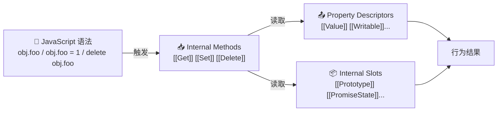
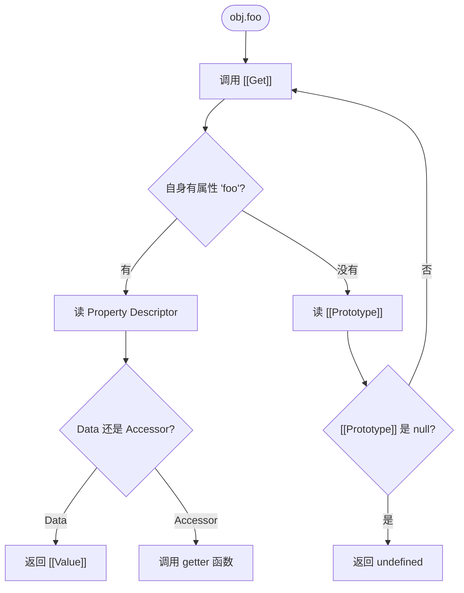
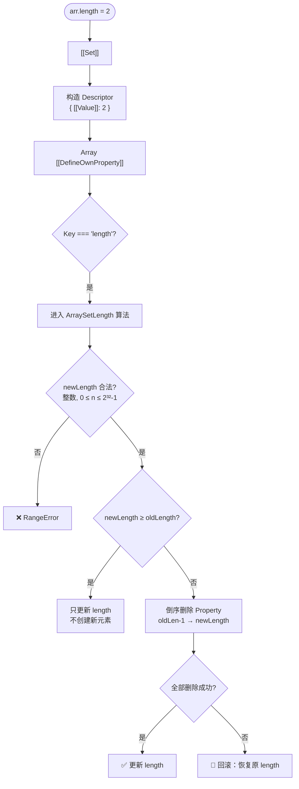
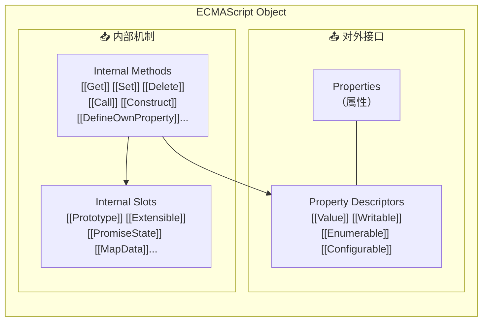
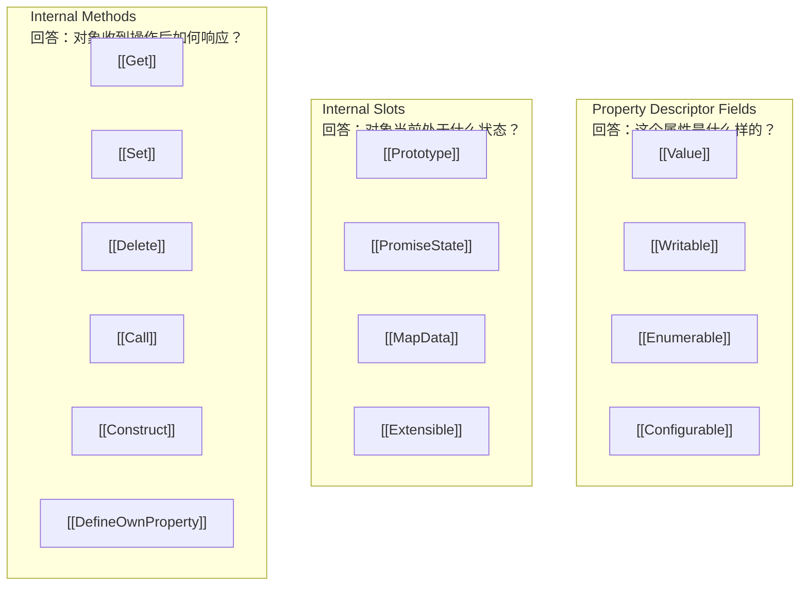

```javascript
const arr = [1, 2, 3, 4];
arr.length = 2;
console.log(arr);  // [1, 2]
```

每个 JavaScript 开发者都见过这段代码。但仔细一想，这件事其实挺反直觉的——你只是把一个数字从 `4` 改成了 `2`，数组最后两个元素就真的消失了。

换成普通对象试试：

```javascript
const obj = { count: 4, a: 1, b: 2 };
obj.count = 2;
console.log(obj);  // { count: 2, a: 1, b: 2 }
```

修改 `count`，其它属性纹丝不动。凭什么数组就能**改一个属性，整个对象结构都跟着变**？

很多人会脱口而出：「因为 `length` 是特殊属性。」这当然没错。但真正值得追问的是——**ECMAScript 到底靠什么机制，让一个属性拥有如此「特殊」的行为？**

答案藏在三层抽象里：

- **Property Descriptor**：描述每个属性的元数据
- **Internal Slot**：对象保存内部状态的地方
- **Internal Method**：对象执行操作时遵循的规范算法

`length` 只是露出水面的接口。真正驱动行为的，是水下的这三层。理解了它们，你会发现——数组删元素、函数可调用、Promise 维护状态、Map 维护键值——这些看似毫无关联的语言特性，其实都建立在同一套对象模型之上。

---

## 一个对象，到底由什么组成？

大多数人对 JavaScript 对象的认知是 key-value：

```javascript
const person = { name: 'Tom', age: 20 };
```

但 ECMAScript 视角下的对象，结构更接近这样：



这里最关键的信息是：**你写的 JavaScript 语法，从来不会直接操作属性。** 语法只是入口，它会触发 Internal Method，Internal Method 再去读取 Property Descriptor 和 Internal Slot，最后得出结果。

Property Descriptor（属性描述符）回答的是「这个属性什么样」——它是否可写、可枚举、可删除、值是 data 还是 getter/setter。但一个对象远不止属性——它还有内部状态和内部行为。接下来，我们从 Internal Slot 开始。

---

## Internal Slot：状态被藏在哪里？

`person.name` 这样的 Property 属于对象对外暴露的接口——你看得见、改得着。但 ECMAScript 还规定，每个对象都拥有一些**无法通过 JavaScript 代码直接访问的内部状态**，规范把它们叫作 **Internal Slot（内部槽）**。

一个更诚实的对象结构图是这样的：

```
Object
├── Properties（对外暴露）
│   ├── name  → Property Descriptor
│   ├── age   → Property Descriptor
│   └── length → Property Descriptor
│
└── Internal Slots（内部状态，不对外暴露）
    ├── [[Prototype]]
    ├── [[Extensible]]
    ├── [[PromiseState]]
    ├── [[MapData]]
    └── ...
```

注意——`[[Prototype]]`、`[[PromiseState]]` 这些**不是属性**。它们不会出现在 `Object.keys()`、`for...in`、`Reflect.ownKeys()` 的结果中。甚至 `obj.[[Prototype]]` 本身就是非法语法——`[[...]]` 只是规范用来标记内部状态的记法。如果你写：

```javascript
obj["[[Prototype]]"] = 123;
```

得到的只是一个恰好叫 `"[[Prototype]]"` 的普通属性，跟真正的 `[[Prototype]]` 毫无关系。

### 为什么叫 Slot？

Slot 可以理解成**插槽、槽位**。这个名字很形象。

把对象想象成一栋房子。你每天接触的是客厅、书房——对应用 `Object.keys()` 能看到的 Property。但一栋房子能正常运行，还依赖配电间、水管井这些住户压根不去的区域。Internal Slot 就像这些地方——它们保存的不是给住户用的数据，而是房子自身运行需要的内部状态。

所以对象可以简单分成两层：

```
Property   → 给开发者使用
Internal Slot → 给对象自己使用
```

### Slot 里存的是什么？

不同的 Slot 保存不同的内部状态。几个最常见的：

| Slot | 保存的内容 |
|------|-----------|
| `[[Prototype]]` | 当前对象的原型引用 |
| `[[Extensible]]` | 对象是否允许继续添加属性 |
| `[[PromiseState]]` | Promise 当前状态（pending / fulfilled / rejected） |
| `[[MapData]]` | Map 内部维护的键值记录 |

它们保存的都是**对象运行过程中需要的内部信息**，而不是对外暴露的业务数据。换句话说，Internal Slot 回答的是：**对象当前处于什么状态（State）。**

---

## 为什么 Slot 不能做成普通属性？

一个很自然的问题是：既然 Slot 本质上也是数据，为什么不直接做成普通属性？

```javascript
obj.internalPrototype = ...
obj.internalPromiseState = ...
```

这样不是更简单？

答案在于——**Internal Slot 保存的是对象运行时必须保持「一致性」的状态**。如果把它暴露为普通属性，任何代码都可以随意修改，维持一致性就无从谈起。

更重要的是一个容易被忽略的技术理由：**Internal Slot 根本不属于属性系统。** 它不参与：

- Property Descriptor 的约束（`writable: false` 对它无效）
- 属性查找和枚举
- `delete` 操作
- getter / setter
- Proxy 的属性拦截

这意味着 Internal Slot 拥有一套**完全独立于 Property 的生命周期**。ECMAScript 引入 Internal Slot，不只是为了「隐藏实现细节」——更准确地说，是为了建立一道语义边界：**对象的运行状态，只能通过规范定义的 API 修改，不能被外部代码随意篡改。**

你虽然无法直接访问 Internal Slot，但每天都在间接使用它们：

```javascript
Object.getPrototypeOf(obj)   // 读 [[Prototype]]
Object.isExtensible(obj)     // 读 [[Extensible]]
promise.then(cb)             // 依赖 [[PromiseState]]
```

---

## 不同对象，不同的 Slot

并不是所有对象都有同一套 Internal Slot。**一个对象是什么「类型」，本质上是由它拥有哪些 Internal Slot 决定的。**

- 普通对象：`[[Prototype]]`、`[[Extensible]]`
- Promise：`[[PromiseState]]`、`[[PromiseResult]]`、`[[PromiseFulfillReactions]]`、`[[PromiseRejectReactions]]`
- Map：`[[MapData]]`
- Set：`[[SetData]]`
- RegExp：`[[OriginalSource]]`、`[[OriginalFlags]]`
- Date：`[[DateValue]]`
- Generator：`[[GeneratorState]]`

很多内置对象的方法，第一步就是检查目标对象是否拥有特定的 Internal Slot。如果没找到，直接抛 TypeError：

```javascript
Map.prototype.get.call({}, "x");       // TypeError — {} 没有 [[MapData]]
Date.prototype.getTime.call({});       // TypeError — {} 没有 [[DateValue]]
Promise.prototype.then.call({});       // TypeError — {} 没有 [[PromiseState]]
```

对于 ECMAScript 而言，Promise 之所以是 Promise，不是因为它 `instanceof Promise`，而是因为它拥有 Promise 要求的那组 Internal Slot。**Slot 决定类型，而不是 `constructor` 决定类型。**

---

### 规范抽象，不是引擎实现

读到这，你可能会想象 V8 引擎里真有一个叫 `[[Prototype]]` 的字段。其实不是。

ECMAScript 从来不会规定引擎「怎么存」这些状态。规范规定的只是——**对象在逻辑上必须拥有这些状态，并且对象行为必须符合规范定义。** 至于引擎内部是用隐藏字段、独立内存区域、指针、Hidden Class、Shape，还是别的什么数据结构来实现，全是引擎自己的事。

因此：**Internal Slot 是一种规范抽象（Specification Abstraction），而不是某种固定的数据结构。** 规范定义行为，引擎决定实现——正是因为二者解耦，不同的 JavaScript 引擎才能采用完全不同的内部架构，却表现出一模一样的 JavaScript 行为。

### Private Field ≠ Internal Slot

学习 Internal Slot 时很容易联想到 ES2022 引入的 Private Field：

```javascript
class Person {
  #name = "Tom";
}
```

`#name` 也是 Internal Slot 吗？**不是。** 两者虽然都有「隐藏」的特点，但隐藏的原因截然不同：

| | Private Field | Internal Slot |
|---|---|---|
| **本质** | JavaScript 语言特性 | ECMAScript 规范抽象 |
| **访问方式** | 通过 `#` 语法在类内部访问 | 没有任何对应语法 |
| **归属** | 对象公开语义的一部分 | 对象运行时内部状态 |
| **JS 能否直接读写** | 能（在类内部） | 永远不能 |

一个面向开发者，一个面向语言规范——服务的目标完全不同。

---

## Internal Method：谁在执行对象的行为？

到目前为止，我们讨论的都是**对象存了什么状态**（State）。但知道状态还不够——状态自己不会动。

- `[[Prototype]]` 保存了原型引用，但它不会自己沿着原型链查属性
- `[[PromiseState]]` 保存了 Promise 状态，但它不会自己调度 `.then()` 回调
- `[[MapData]]` 保存了键值记录，但它不会自己完成增删查

这些行为由另一套机制负责——**Internal Method（内部方法）**。

```
Internal Slot   → 记录状态（State）
Internal Method → 定义行为（Behavior）
```

一个容易被忽略的事实是：**几乎所有 JavaScript 语法，最终都会转化为对某个 Internal Method 的调用。**

```text
obj.foo        → [[Get]]
obj.foo = 1    → [[Set]]
delete obj.foo → [[Delete]]
fn()           → [[Call]]
new Foo()      → [[Construct]]
```

ECMAScript 并不是围绕 JavaScript 语法来描述对象行为的。恰恰相反——它先定义「一个对象应该实现哪些 Internal Method」，再规定「某种 JavaScript 语法会触发哪个 Internal Method」。语法只是入口，Internal Method 才是真正干活的地方。

### 所有普通对象，都有一套「基本方法」

ECMAScript 要求所有普通对象（Ordinary Object）都实现一组 **Essential Internal Methods**（基本内部方法）。最核心的包括：

| Internal Method | 触发语法 / API |
|---|---|
| `[[Get]]` | `obj.foo` |
| `[[Set]]` | `obj.foo = 1` |
| `[[Delete]]` | `delete obj.foo` |
| `[[GetOwnProperty]]` | — （`[[Get]]` 内部使用） |
| `[[DefineOwnProperty]]` | `Object.defineProperty()`、赋值时的内部调用 |
| `[[HasProperty]]` | `'foo' in obj` |
| `[[GetPrototypeOf]]` | `Object.getPrototypeOf()` |
| `[[SetPrototypeOf]]` | `Object.setPrototypeOf()` |
| `[[IsExtensible]]` | `Object.isExtensible()` |
| `[[PreventExtensions]]` | `Object.preventExtensions()` |
| `[[OwnPropertyKeys]]` | `Object.keys()`、`Reflect.ownKeys()` |
| `[[Call]]` | `fn()` |
| `[[Construct]]` | `new Fn()` |

你每天都在用这些 Internal Method——只是规范把它们藏在语法糖的后面。

---

## Internal Slot 与 Internal Method 如何协作？

现在，三层模型里已经讲了两层。来看看它们怎么配合。

拿最简单的 `obj.foo` 来说——这是一个 Internal Method 读取 Internal Slot 的经典场景：



`[[Get]]` 是 Internal Method——它负责行为，驱动整个查找流程。而 `[[Prototype]]` 是 Internal Slot——它保存状态，告诉 `[[Get]]` 原型链的下一个节点在哪。

**当对象自身没有属性时，`[[Get]]` 不会就此放弃。** 它会读取 `[[Prototype]]`，然后沿着原型链继续递归调用 `[[Get]]`，直到找到属性或者 `[[Prototype]]` 为 `null`。这就是原型链查找的完整机制——**Internal Method 读取 Internal Slot 作为决策依据，再决定下一步行为。**

同样的协作模式也出现在各种场景中：

- `[[Set]]` 赋值时读取 `[[Extensible]]`，判断对象是否允许新增属性
- `[[DefineOwnProperty]]` 读取当前属性的 `[[Configurable]]`，决定能否修改
- Promise 的 `[[PromiseState]]` 驱动 `.then()` 的调度逻辑

**Slot 存状态，Method 执行行为**——两者永远是一对。

---

## Property Descriptor 与 Internal Method 如何协作？

这里正好能衔接上 Property Descriptor。当你调用 `Object.defineProperty()` 时：

```javascript
Object.defineProperty(obj, "foo", {
  value: 1,
  writable: false,
});
```

你并不是直接「修改一个属性」。你真正做的是——**构造一份新的 Property Descriptor，把它交给对象的 `[[DefineOwnProperty]]`**，由后者决定能不能这样定义。

职责划分非常清晰：

```
Property Descriptor → 描述「要定义成什么样」
[[DefineOwnProperty]] → 决定「能不能这样定义」
```

更完整地说——**整条运行链路**是这样的：

```
JavaScript 语法
      ↓
Internal Method        ← 执行规范算法
      ↓
Property Descriptor    ← 提供属性元数据
      +
Internal Slot          ← 提供对象当前状态
      ↓
最终行为
```

理解了这条链路，后面要讲的各种特殊对象（数组、Proxy、Promise），本质上都只是——**拥有不同的 Internal Slot，并重写了不同的 Internal Method 行为。**

---

## 为什么数组能做到普通对象做不到的事？

ECMAScript 把对象分成两大类：

- **Ordinary Object（普通对象）**：使用默认的 Internal Method 实现
- **Exotic Object（特殊对象）**：重写了其中一个或多个 Internal Method

区别不在于 Property，也不在于 Internal Slot，而在于——**Internal Method 的实现方式不同。**

对一个普通对象赋值：

```text
obj.b = 2
  → [[Set]]
  → 构造新的 Property Descriptor
  → 调用默认的 [[DefineOwnProperty]]
  → 新增属性

结束。没有额外行为。
```

所以 `obj.count = 2` 不会影响 `obj.a`，也不会删除任何属性——普通对象的 `[[DefineOwnProperty]]` 只做「添加或更新属性」这一件事。

数组则不同。数组是一个 **Array Exotic Object**——它重写了自己的 `[[DefineOwnProperty]]`。

```text
普通对象：[[Set]] → 默认的 OrdinaryDefineOwnProperty
数组：    [[Set]] → 数组专属的 [[DefineOwnProperty]]
```

这就是两者行为分叉的起点。来看一个直观的对比：

```javascript
// 普通对象
const obj = { 0: 'a', 1: 'b', 2: 'c', length: 3 };
obj.length = 1;
console.log(obj);  // { 0: 'a', 1: 'b', 2: 'c', length: 1 }
                   // ↑ 其它属性全在，只是 length 变了

// 数组（Array Exotic Object）
const arr = ['a', 'b', 'c'];
arr.length = 1;
console.log(arr);  // ['a']
                   // ↑ 元素真被删了
```

完全相同的语法——`obj.length = 1`——但因为 `[[DefineOwnProperty]]` 的实现不同，行为天差地别。

> 不止数组——Proxy、String 包装对象、Module Namespace 对象、Arguments 对象、TypedArray 都属于 Exotic Object。它们各自重写了不同的 Internal Method，因此表现出截然不同的能力。ECMAScript 并不是靠「特殊属性」创造特殊对象的，而是**靠重写 Internal Method。**

---

## ArraySetLength：修改 `length` 时，到底发生了什么？

回到开头那个问题。`arr.length = 2` 的真实过程是：



### 第一步：合法性检查

不是任何值都能赋给 `length`：

```javascript
arr.length = -1;    // RangeError
arr.length = 1.5;   // RangeError
arr.length = NaN;   // RangeError
arr.length = 4294967296;  // RangeError（超过 2³²-1）
```

这是因为 ECMAScript 要求数组长度必须满足 `0 ≤ length ≤ 2³² − 1` 且为整数。**检查发生在赋值之前，不合法就当场拒绝。**

### 第二步：比较新旧长度

如果 `newLength ≥ oldLength`（数组变长）：

```javascript
const arr = [1, 2];
arr.length = 10;
console.log(arr);  // [1, 2, <8 empty items>]
```

有一点很多初学者会搞错：**数组变长并不会自动创建新元素。** 规范只更新了 `length` 属性，告诉对象「现在允许出现索引 0～9」，但索引 2～9 对应的属性根本还不存在：

```javascript
2 in arr;             // false
Object.hasOwn(arr, 2); // false
```

访问 `arr[2]` 得到 `undefined`，是原型链查找不到时的默认返回——不代表属性存在。这就是「空洞数组（Sparse Array）」能够存在的原因：**`length` 描述的是可用索引范围，而不是实际拥有的属性数量。**

### 第三步：删除超出的 Property

真正精彩的是 `newLength < oldLength` 的情况。

```javascript
const arr = [1, 2, 3, 4];
arr.length = 2;
```

此时 `oldLength = 4`，`newLength = 2`。规范不会直接改 `length = 2` 了事——那样会立即产生矛盾（对象仍拥有属性 `"2"` 和 `"3"`，但 `length` 声明最大索引应小于 2）。所以规范的顺序是**反过来的**：

```
先删除 Property "3"
  → 再删除 Property "2"
    → 最后更新 length
```

这里有一个很容易被忽略的关键点：规范强调的是 **Delete Property**，而不是「把值改成 `undefined`」。

```javascript
// 删除后
arr[2];      // undefined
2 in arr;    // false

// 对比：赋值为 undefined
arr[2] = undefined;
2 in arr;    // true  ← 属性还在！只是值为 undefined
```

从 Property Descriptor 的视角看，**删除是 Property 消失，赋值只是 `[[Value]]` 变成了 `undefined`。** 这是两个完全不同的操作。

---

### 删除失败怎么办？——回滚机制

`ArraySetLength` 真正精妙的地方，不是删除本身，而是规范为了保证数组一致性设计的一套**回滚（Rollback）机制**。

来看一个完整示例：

```javascript
const arr = [1, 2, 3];

// 将索引 2 设为不可删除
Object.defineProperty(arr, "2", {
  configurable: false,
});

// 现在尝试收缩数组
arr.length = 1;

console.log(arr.length);  // 3  ← 没变！
console.log(arr);         // [1, 2, 3]  ← 元素也全在
```

实际发生的事情是：

1. 收到新 `length` Descriptor（`[[Value]]: 1`）
2. 进入 `ArraySetLength`
3. 尝试删除 `Property "2"` → **失败**（`[[Configurable]]` 为 `false`）
4. **立即终止整个算法，恢复原 `length`**

规范不允许 `length = 1` 但 `Property "2"` 仍然存在这种自相矛盾的状态。整个过程更像数据库事务——所有步骤成功，才提交结果；任何一步失败，全盘回滚。

值得注意的是：删除失败的根本原因不在数组，而在 **Property Descriptor**。`[[Configurable]]: false` 禁止了删除操作——真正控制删除是否成功的，始终是 Property Descriptor 的约束，数组只是忠实地遵守了它。

---

### 为什么倒序删除？

正文多次提到 `ArraySetLength` 删除元素时采用**倒序**——从 `oldLength - 1` 一直删到 `newLength`。这不是随意的设计。

假设数组 `[1, 2, 3, 4]` 需要收缩到 `length = 2`，要删除索引 `2` 和 `3`：

- 如果从后往前（先删 `3`，再删 `2`），无论何时当前数组的长度都不会与剩余属性发生冲突，对象始终保持一致。
- 更重要的是——倒序可以保证**一旦某次删除失败，剩余未删除的属性仍保持连续**，为回滚机制创造了干净的现场。

所以倒序并不是语法糖，而是为复杂边界情况下的健壮性服务的设计选择。

---

## ECMAScript 对象协议：把一切串起来

到这里，我们可以用一张图看清 ECMAScript 对象模型的全貌：



现在可以正面回答文章开头的问题了。`arr.length = 2` 并不是「改了一个数字」，真正发生的是：

```
JavaScript 语法
  → [[Set]]
  → 构造 Property Descriptor
  → Array [[DefineOwnProperty]]（被重写过的版本）
  → ArraySetLength 算法
  → 检查合法性 → 必要时删除属性 → 必要时回滚 → 更新 length
```

整个过程远比一次普通赋值复杂得多。但更重要的是——这个问题的答案，通向了比数组更广阔的东西。

---

## 附录：三种 `[[...]]`，不是同一种东西

很多人第一次打开 ECMA-262 时会产生一个困惑：

```
[[Prototype]]
[[PromiseState]]
[[Value]]
[[Writable]]
[[Get]]
[[Delete]]
[[DefineOwnProperty]]
```

它们全都写成 `[[...]]`，很容易被当成同一类东西。**其实不是。** 双中括号只是规范的一种命名记法，并不表示某种统一的数据结构。

这些名字实际上代表**三类完全不同的概念**：



下次你在规范里看到 `[[...]]`，花一秒问自己：它在描述一个属性的特征，对象的状态，还是对象的行为？这个问题，就是读懂 ECMA-262 的钥匙。

---

## 总结

ECMAScript 从来不是一门「操作属性」的语言，而是一门**「触发对象协议（Object Protocol）」的语言**。

你写下的每一行 JavaScript 语法，最终都会转化为对某个 Internal Method 的调用。Internal Method 再结合 Property Descriptor 与 Internal Slot，决定对象应该如何响应。

- **Property 是接口**——你通过它和对象对话
- **Property Descriptor 是元数据**——描述属性的全部特征
- **Internal Slot 是状态**——保存对象运行时的内部信息
- **Internal Method 是行为协议**——定义对象如何回应每一个操作

理解了这四者的分工，你就能理解为什么数组可以删除元素、函数可以被调用、Promise 可以维护状态、Proxy 可以接管对象行为。它们看起来是不同的语言特性，但在 ECMAScript 的视角里，只是同一个对象模型的不同实现——**每种 Exotic Object 通过重写一组 Internal Method，表达出自己的独特语义，而 Property Descriptor 和 Internal Slot 永远是这些语义的基石。**

Property 只是露出水面的那一部分。真正驱动整个 JavaScript 语言运行的，是水下的三层抽象——**元数据（Descriptor）、状态（Slot）、行为协议（Method）**。这三者，构成了 ECMAScript Object Protocol。

---

## 延伸阅读

- 本系列的上一篇深入讲解了 **Property Descriptor** 的完整机制——Data Property 与 Accessor Property 的区别、`writable`/`configurable`/`enumerable` 的精确语义，以及 `Object.defineProperty()` 的工作原理。
- 下一篇将展开 **Proxy 和 Reflect**——Proxy 如何通过替换 Internal Method 来接管对象行为，Reflect 又如何将 Internal Method 的语义直接暴露给开发者。两者看似不同，本质上服务于同一个对象模型。
- 如果你有兴趣直接阅读规范，ECMA-262 中 [Ordinary Object Internal Methods](https://tc39.es/ecma262/#sec-ordinary-object-internal-methods-and-internal-slots) 和 [Array Exotic Objects](https://tc39.es/ecma262/#sec-array-exotic-objects) 是理解本文内容的最佳入口。
