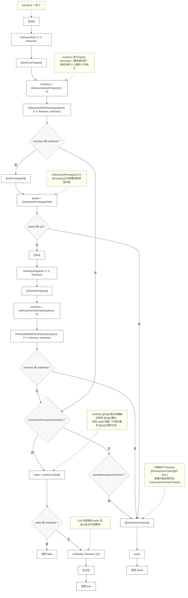
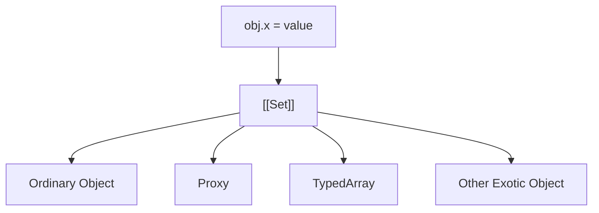

# 用一个例子，串起 ECMAScript 对象模型

## 一、现象：一条普通赋值，为什么会触发原型上的 setter？

```javascript
const proto = {
  set name(value) {
    console.log('setter:', value);
  },
};

const obj = Object.create(proto);

obj.name = '张三';
// setter: 张三
```

`obj` 自身并没有 `name` 属性。

然而，当执行：

```javascript
obj.name = '张三';
```

时，引擎并没有直接在 `obj` 上创建一个新的属性，而是沿着原型链找到了 `proto.name`。

由于它是一个**访问器属性（Accessor Property）**，最终执行了对应的 setter。

这个现象本身并不陌生。

真正值得追问的，并不是这次赋值经历了多少个步骤，而是：

> **为什么这样一条看似简单的赋值语句，会依次涉及对象、原型、属性描述符、setter 等一系列机制？**

换句话说，我们真正想理解的是：

> **ECMAScript 是如何组织对象行为的。**

本文将沿着这条赋值语句的执行路径，一步一步看看它经过了哪些角色，以及这些角色如何共同组成 ECMAScript 的对象模型。

## 二、上面这段代码，在规范里是什么样？



---

| 步骤 | 规范位置 | 条款 |
|------|----------|------|
| `[[Set]]` | 10.1.9 | `[[Set]]` ( propertyKey, value, receiver ) |
| `OrdinarySet` | 10.1.9.1 | OrdinarySet ( O, P, V, Receiver ) |
| `OrdinarySetWithOwnDescriptor` | 10.1.9.2 | OrdinarySetWithOwnDescriptor ( O, P, V, Receiver, ownDesc ) |
| `[[GetOwnProperty]]` | 10.1.5 | `[[GetOwnProperty]]` ( P )（其 OrdinaryGetOwnProperty 为 10.1.5.1）|
| `[[GetPrototypeOf]]` | 10.1.1 | `[[GetPrototypeOf]]` ( )（其 OrdinaryGetPrototypeOf 为 10.1.1.1）|
| `IsAccessorDescriptor` | 6.2.6.1 | IsAccessorDescriptor ( Desc ) |
| `IsDataDescriptor` | 6.2.6.2 | IsDataDescriptor ( Desc ) |
| `CreateDataProperty` | 7.3.5 | CreateDataProperty ( O, P, V ) |
| `Call` | 7.3.13 | Call ( func, thisValue [, argList ] ) |
| `[[Call]]` | 10.2.1 | `[[Call]]` ( thisArg, argList )（ECMAScript 函数对象；内置函数对象的 `[[Call]]` 为 10.3.1）|

> 注：严格来说，赋值表达式 `obj.name = '张三'` 会先经过 `EvaluateAssignmentExpression` 求值，再由 `PutValue` 抽象操作调用对象的 `[[Set]]` 内部方法，但这些步骤处理的是赋值表达式本身的语义，与对象模型无关，因此后文直接从 `[[Set]]` 入口开始。

---

第一次看到这张图，大多数人都会有一种感觉：

> **名字很多，而且几乎一个都不认识。**

例如：

```
[[Set]]
OrdinarySet
OrdinarySetWithOwnDescriptor
[[GetOwnProperty]]
[[GetPrototypeOf]]
OrdinaryDefineOwnProperty
IsAccessorDescriptor
IsDataDescriptor
Call
[[Call]]
[[Prototype]]
```

它们既不是 JavaScript 语法，也不是运行时提供的 API。

它们全部来自 ECMAScript 规范，用来描述：

> **当 JavaScript 引擎执行一段代码时，内部究竟发生了什么。**

不过，现在并不需要急着理解每一个名字。

先退一步观察，会发现它们其实并不是同一种东西，而是在整个执行过程中扮演着不同的角色。

例如：

| 类型                         | 例子                                                                                         |
| -------------------------- | ------------------------------------------------------------------------------------------ |
| Internal Method（内部方法）      | `[[Set]]`、`[[GetOwnProperty]]`、`[[GetPrototypeOf]]`、`[[Call]]`                             |
| Abstract Operation（抽象操作）   | `OrdinarySet`、OrdinarySetWithOwnDescriptor、`IsAccessorDescriptor`、`IsDataDescriptor`、`Call` |
| Property Descriptor（属性描述符） | `ownDesc`                                                                                  |
| Internal Slot（内部槽位）        | `[[Prototype]]`                                                                            |

如果把整张流程图看成一次旅行，那么这些名字并不是一串零散的站点，而是旅途中不断出现的几类角色。

例如：

* `[[Set]]` 接收一次属性赋值请求；
* `OrdinarySet` 负责执行普通对象的默认赋值算法；
* `ownDesc` 描述当前属性究竟是什么；
* `[[Prototype]]` 决定下一步应该去哪个对象继续查找。

整条执行路径，就是这些角色彼此协作的过程。

因此，接下来的内容也不会按照 ECMAScript 规范的章节顺序逐个解释这些术语，而是沿着这条赋值路径，依次认识它们在对象模型中的职责。

第一位出场的角色，就是对象如何响应一次操作。

---

## 三、对象如何响应一次操作：从 `Internal Method` 到 `OrdinarySet`

上一章，我们已经将：

```javascript
obj.name = "张三";
```

拆解成了：

```text
obj.name = "张三"
↓
[[Set]]
↓
OrdinarySet
```

许多人在第一次读规范时，都会产生一个疑问：既然 `OrdinarySet` 已经负责完成属性赋值，为什么规范还要设计一个 `[[Set]]`？

换个问法就是 —— 为什么赋值流程不是 `obj.name = "张三" -> OrdinarySet` 直接结束？

ECMAScript 为什么要多出 `[[Set]]` 这一层？

要回答这个问题，我们需要先换一个角度来理解对象。

---

### ECMAScript 是围绕 Internal Method 定义对象的

大多数 JavaScript 开发者会把对象理解成：

> 保存 Property 的容器。

但在 ECMAScript 规范里，对象首先被定义成：

> 能够响应一组操作（Operations）的实体。

为了描述这些操作，ECMAScript 定义了一组：

```text
Internal Method（内部方法）
```

例如：

```text
[[Get]]
[[Set]]
[[Delete]]
[[HasProperty]]
[[GetOwnProperty]]
[[DefineOwnProperty]]
[[GetPrototypeOf]]
[[SetPrototypeOf]]
```

这些方法并不是：

```javascript
obj.[[Set]]()
```

这种可以直接调用的 JavaScript API。

它们属于：

> ECMAScript 规范中的抽象操作接口（Abstract Operation Interface）。

它们描述的是：

> 一个对象应该能够响应什么行为。

例如：

```text
[[Set]]
```

并不关心属性如何写入，只规定：

> 对象需要支持“设置属性”这件事情。

```text
[[Get]]
```

也不关心属性如何读取，只规定：

> 对象需要支持“读取属性”这件事情。

因此，可以把 Internal Method 理解成：

> 对象行为的抽象接口。

JavaScript 语法最终都会映射到这些 Internal Method：

| JavaScript Syntax | Internal Method   |
| ----------------- | ----------------- |
| `obj.name`        | `[[Get]]`         |
| `obj.name = "张三"` | `[[Set]]`         |
| `delete obj.name` | `[[Delete]]`      |
| `"name" in obj`   | `[[HasProperty]]` |

可以简单表示为：

```text
JavaScript Syntax
        ↓
 Internal Method
```

因此：

> ECMAScript 描述对象行为时，是围绕 Internal Method 组织对象模型的。

---

### 为什么规范需要 `InternalMethod` 这一层抽象？

现在回到最开始的问题。

为什么：

```text
obj.name = value
↓
[[Set]]
↓
OrdinarySet
```

而不是：

```text
obj.name = value
↓
OrdinarySet
```

原因在于：**同一句 JavaScript，在不同对象上可能意味着完全不同的行为。**

- 对普通对象 `obj.x = 1`，语义是「创建属性」；
- 对 Proxy `proxy.x = 1`，语义是「触发 set trap」；
- 对 TypedArray `ta[100] = 1`，语义是「边界检查 → 数值转换 → 写入底层 Buffer」；
- 对不可扩展对象 `Object.preventExtensions(obj); obj.x = 1`，语义是「赋值失败」。

可见，完全相同的 `obj.x = value` 背后隐藏着截然不同的语义。

如果规范直接写成 `obj.x = value → OrdinarySet`，那 Proxy 怎么办？TypedArray 怎么办？未来新的对象类型怎么办？  

规范总不能把所有对象类型硬编码成一大串：

```text
if OrdinaryObject
if Proxy
if TypedArray
if ...
```

于是 ECMAScript 采用了另一种设计：**语言只发出统一请求 `[[Set]]`，至于如何响应，由对象自己决定。**

```
obj.x = value
      ↓
   [[Set]]
      ↓
 对象自己的实现
```

可以表示为：



对 ECMAScript 来说，`[[Set]]` 是一种统一的行为协议——所有对象都需要支持「设置属性」这个能力，但具体如何完成，则由对象自行实现：

- `OrdinaryObject.[[Set]]` → `OrdinarySet`
- `Proxy.[[Set]]` → `set trap`
- `TypedArray.[[Set]]` → `Integer Indexed Element Set`

因此，**Internal Method 解决的不是“如何实现行为”，而是“如何统一描述行为”**：它提供统一协议，把具体实现交给不同对象，这就是 ECMAScript 对象模型中的**行为多态**。

---

### `[[Set]]` 与 `OrdinarySet` 的关系

顺着上面的思路，`[[Set]]` 和 `OrdinarySet` 虽然名字上容易混淆，但职责完全不同——一个定义“应该做什么”，一个定义“默认怎么做”。

- **`[[Set]]`** 定义对象应该支持什么行为
- **`OrdinarySet`** 定义普通对象如何完成这种行为

如果借用面向对象里的概念：

- Internal Method → 接口（Interface）
- Ordinary Algorithm → 默认实现（Default Implementation）

当然，ECMAScript 规范并不是面向对象框架，这只是帮助理解它们之间的关系。

---

### `Ordinary Object` 与 `Exotic Object`

既然 `[[Set]]` 允许对象拥有自己的实现，那么规范自然会区分两类对象。

**第一类：Ordinary Object（普通对象）**

例如 `{}`、`[]`、`function() {}`，它们的大多数 Internal Method 都采用规范提供的默认实现：

```text
OrdinaryObject.[[Set]]
↓
OrdinarySet
```

**第二类：Exotic Object（异质对象）**

它们会重写某些 Internal Method，例如：

- Proxy：`Proxy.[[Set]]` 先查找 `set` trap；若不存在，则转发到 target 的 `[[Set]]`
- TypedArray：`TypedArray.[[Get]]`、`TypedArray.[[Set]]` 都拥有特殊实现

需要注意的是，Exotic Object 并不意味着所有 Internal Method 都被重写。例如 Array 虽然属于 Exotic Object，但它的 `[[Set]]` 仍然使用 `OrdinarySet`。不过，`OrdinarySet` 的执行路径最终会调用 `Receiver.[[DefineOwnProperty]]` 来完成属性创建，而 Array 重写了 `[[DefineOwnProperty]]` 以实现 `length` 的自动维护。因此，`arr[100] = 1` 看似简单，底层仍会触发 Array 特有的长度调整逻辑。

因此：

> Ordinary Object 与 Exotic Object 的区别，不在于是否拥有 Internal Method，而在于是否重写了某些 Internal Method 的默认实现。

---

### 延伸阅读：规范中的“入口”和“实现”并不总在同一层

通过 `[[Set]]` 和 `OrdinarySet` 的关系，我们可能会形成一种印象：

> Internal Method 是入口，Abstract Operation 是实现。

但这并不是 ECMAScript 规范的固定模式。

属性赋值采用的是：

```text
obj.x = value
        ↓
      [[Set]]
        ↓
   OrdinarySet
```

`[[Set]]` 是统一的操作入口，`OrdinarySet` 负责普通对象的具体实现。

而函数调用采用的却是另一种结构：

```text
fn()
 ↓
Call
 ↓
fn.[[Call]]
```

这里 `Call` 是统一入口，`[[Call]]` 才是由具体函数对象实现的行为。（与赋值表达式类似，函数调用 `fn()` 实际会先经过 `EvaluateCall` 等表达式求值步骤，再到 `Call`；本文同样省略了求值阶段的处理。）

可以发现，两者都是“入口 → 实现”的两层结构，只是入口所在的层级恰好相反：

- 属性赋值：Internal Method（分发）→ Abstract Operation（实现）
- 函数调用：Abstract Operation（入口）→ Internal Method（实现）

原因在于，ECMAScript 并没有规定哪一层必须负责分发、哪一层必须负责实现。  
规范会根据需要，把多态分发和公共逻辑放在不同层级。

因此，在阅读 ECMAScript 规范时，不应把 `Internal Method → Abstract Operation` 或 `Abstract Operation → Internal Method` 视为固定规则。  
真正稳定的模式只有一个：

> 规范通常会把“统一入口”和“具体实现”拆成两个层次；至于入口落在哪一层，则取决于规范希望把多态分发和公共逻辑放在哪里。

---

### 下一站：`Property Descriptor`

到这里，我们已经认识了对象模型中的第一块拼图——**Internal Method**。它回答的是「对象如何响应一次操作」，也就是行为层面的问题。

但这条链路还没走完。`OrdinarySet` 收到赋值请求后，并不会立刻修改对象，因为它首先需要知道：当前这个 Property 究竟是数据属性、访问器属性，还是根本不存在？这些信息并不保存在 `[[Set]]` 里，而是保存在另一种结构——**Property Descriptor** 中。

于是整条赋值路径就延伸为：

```text
obj.name = "张三"
       ↓
    [[Set]]
       ↓
 OrdinarySet
       ↓
[[GetOwnProperty]]
       ↓
Property Descriptor
```

下一章，我们继续沿着这条路径往下走，看看 ECMAScript 为什么需要先描述清楚一个 Property 的语义，再决定如何完成一次赋值。

---

## 四、`Property Descriptor`：Property 的语义是如何被描述的

上一章我们已经知道：

```text
obj.name = "张三"
↓
[[Set]]
↓
OrdinarySet(O, P, V, Receiver)
```

但 `OrdinarySet` 收到赋值请求以后，并没有立刻修改对象。它做的第一件事是：

```text
ownDesc = O.[[GetOwnProperty]](P)
```

这里藏着一个很容易被忽略的细节：如果只是想给 `name` 赋值，我们似乎只需要知道 `obj.name` 最终是 `"张三"` 还是 `undefined` 就够了。可规范并没有直接去取属性的值，而是先拿到了一个叫做 `ownDesc` 的东西——它既不是 `"张三"`，也不是 `undefined`，而是 **Property Descriptor（属性描述符）**。

为什么会多出这一层？ECMAScript 为什么不直接操作属性，而要先去获取一份描述符？要回答这个问题，需要先问另一个更根本的问题：

> **对于 ECMAScript 来说，一个 Property 究竟是什么？**

---

### 为什么 `Property` 需要一张说明书？

对于大多数 JavaScript 开发者来说，一个 Property 往往可以理解成 `name → value`，例如 `const obj = { name: "张三" }` 中的 `name` 就对应 `"张三"`。这种理解在日常开发中已经足够，但站在 ECMAScript 规范的角度，它并不完整。

比如使用 getter 时：

```javascript
const obj = {
  get name() {
    return "张三";
  },
};
```

这里的 `name` 并没有保存任何值，读取 `obj.name` 时真正发生的是执行 getter 并返回 `"张三"`。

又比如：

```javascript
Object.defineProperty(obj, "name", {
  value: "张三",
  writable: false,
  enumerable: false,
  configurable: false,
});
```

这个 Property 除了值以外，还包含“是否允许写入”、“是否参与枚举”、“是否允许重新定义”等信息，这些都会影响 Property 的行为。

因此，对 ECMAScript 来说，**Property 并不仅仅是一个值，而是一组语义（Semantics）的集合**。它需要描述：保存什么数据？是否允许写入、枚举、删除或重新定义？它保存的是数据还是 getter/setter？只有先回答这些问题，算法才能决定应该如何处理这个 Property。

于是，规范引入了一种专门描述 Property 的记录结构——**Property Descriptor（属性描述符）**。可以把它理解成 Property 的元信息（Metadata），或者说一张说明书。算法真正处理的，并不是 Property 的值本身，而是这张说明书。

---

### `Property Descriptor` 的结构与两种形态

规范中的 Property Descriptor 可以理解成一份记录（Record），它可能包含 `[[Value]]`、`[[Writable]]`、`[[Get]]`、`[[Set]]`、`[[Enumerable]]`、`[[Configurable]]` 这些字段。有两点需要注意：第一，它不是 JavaScript 对象；第二，它不会同时拥有所有字段——规范会根据字段的不同组合，来描述不同类型的 Property。这些字段共同决定了 **一个 Property 应该表现出什么行为**。

规范将 Property Descriptor 分为两类。

#### `Data Descriptor`

最常见的是数据属性（Data Property），例如 `const obj = { name: "张三" }`。在规范中，它对应的 Descriptor 大致可以理解成：

```text
{
  [[Value]]: "张三",
  [[Writable]]: true,
  [[Enumerable]]: true,
  [[Configurable]]: true
}
```

它保存的是属性的值、是否允许修改、是否参与枚举、是否允许重新定义，描述的是一种 **保存数据的 Property**。

#### `Accessor Descriptor`

另一类是访问器属性（Accessor Property），例如：

```javascript
const proto = {
  set name(value) {
    console.log(value);
  },
};
```

对应的 Descriptor 可以理解成：

```text
{
  [[Get]]: undefined,
  [[Set]]: setterFunction,
  [[Enumerable]]: true,
  [[Configurable]]: true
}
```

和 Data Descriptor 最大的区别在于：它没有 `[[Value]]` 和 `[[Writable]]`，取而代之的是 `[[Get]]` 和 `[[Set]]`。也就是说，**Accessor Property 不直接保存数据，而是保存一组读取和写入行为**。因此，执行 `obj.name = "张三"` 时，发生的并不是 `[[Value]] = "张三"`，而是 `Call(setter)`——因为 Descriptor 中保存的是 `[[Set]]` 指向的 setter 函数，而非 `[[Value]]`。

Vue 2 正是利用这一点，通过 `Object.defineProperty()` 给属性安装 getter 和 setter，在读取时收集依赖，在写入时通知更新。从规范的角度看，这正是 Accessor Descriptor 的典型应用：**Property 保存的不再是数据，而是行为**。

---

### 为什么 `Object.defineProperty()` 长这样？

平时我们定义属性非常简单：

```js
obj.name = "张三";
```

只需要一个值。

而 `Object.defineProperty()` 却要求传入一个对象：

```js
Object.defineProperty(obj, "name", {
  value: "张三",
  writable: false,
  configurable: false,
  enumerable: false,
});
```

如果站在 Property Descriptor 的角度看，这种设计其实非常自然。传给 `defineProperty` 的第三个参数，本质上是 Property Descriptor 的 JavaScript 表示。这个对象里的 `value`、`writable`、`configurable`、`enumerable` 正好对应规范中的 `[[Value]]`、`[[Writable]]`、`[[Configurable]]`、`[[Enumerable]]`。

整个过程可以理解为：

```
JavaScript Object
        ↓
ToPropertyDescriptor
        ↓
Property Descriptor
        ↓
[[DefineOwnProperty]]
```

规范先读取对象上的 `value`、`writable`、`get`、`set`、`enumerable`、`configurable`，构造出真正的 Property Descriptor，然后再交给 `[[DefineOwnProperty]]` 完成属性定义。所以 `Object.defineProperty()` 并没有创造新的属性系统，它只是允许开发者直接构造 Property Descriptor。相比之下，`obj.name = "张三"` 不过是更上层的语法糖。

---

### 为什么 Descriptor 不是 JavaScript 对象？

虽然 `Object.defineProperty` 的第三个参数看起来和 Descriptor 一模一样，但规范仍然强调：**Property Descriptor 不是 JavaScript 对象**。因为它们处在不同的层面：Property Descriptor 是 ECMAScript 规范中的一种抽象 Record，和 Completion Record、Environment Record、Module Record 一样，只存在于规范中，JavaScript 代码无法直接访问。

例如，规范中的 `[[GetOwnProperty]]` 内部方法返回的是 Property Descriptor，但你永远不能写成 `obj.[[GetOwnProperty]]("name")`。开发者能拿到的只是 `Object.getOwnPropertyDescriptor(obj, "name")` 返回的普通对象：

```js
{
  value: "张三",
  writable: true,
  enumerable: true,
  configurable: true
}
```

这个对象只是 Descriptor 的运行时映射，而不是 Descriptor 本身。更准确的关系是：**Property Descriptor** → **JavaScript Representation**，而不是同一个东西。

---

### Descriptor 在对象模型中的位置

Descriptor 只回答一个问题：**当前属性具有什么语义？** —— 能否写入？能否枚举？能否重新定义？保存的是值还是 getter/setter？这些全都属于属性自身的信息。

如果沿用前面的视角，可以这样定位：

- 对象如何响应操作？ → **Internal Method**
- 属性具有什么语义？ → **Property Descriptor**

因此，Property Descriptor 是属性静态元信息的统一描述，供各种内部算法读取和决策。算法并不直接研究属性，而是研究它的 Descriptor。（注：部分 Exotic Object 的属性语义还涉及 `[[Get]]`、`[[Set]]` 等 Internal Method 的特殊实现，Descriptor 本身无法覆盖全部语义。）

---

### 下一站：Internal Slot

到这里我们已经清楚，Property Descriptor 描述的是“属性是什么”。但它回答不了另一个问题：当 `[[GetOwnProperty]]` 返回 `undefined` 后，算法为什么知道继续去 `proto` 上查找？因为对象之间的关系并不保存在 Property Descriptor 中，而是保存在对象的内部状态里 —— 具体来说就是 `[[Prototype]]`。

`[[Prototype]]` 不是属性，也不是 Descriptor，而是一个 **Internal Slot**。如果说 Property Descriptor 回答的是“属性是什么”，那么 Internal Slot 回答的则是“对象处于什么状态”。下一章，我们就沿着这条赋值路径继续向下，看对象如何通过 Internal Slot 保存自己的内部状态。

---

## 五、`Internal Slot`：对象除了 `Property`，还保存着什么？

上一章最后，我们把赋值过程停在了这里：

```text
OrdinarySet(O, P, V, Receiver)
↓
ownDesc = O.[[GetOwnProperty]](P)
↓
undefined
```

当前对象上并不存在 `name` 属性，于是算法继续执行：

```text
parent = O.[[GetPrototypeOf]]()
↓
return O.[[Prototype]]
↓
proto
```

这里第一次出现了一种与 Property 完全不同的数据。

`[[GetPrototypeOf]]` 并不是从某个 Property 中找到 `proto`，而是直接读取对象内部的：

```text
[[Prototype]]
```

而像 `[[Prototype]]` 这样，由对象在内部保存、供规范算法直接访问的数据，在 ECMAScript 中统称为：

```text
Internal Slot（内部槽位）
```

---

### `Internal Slot` 是什么？

可以把 Internal Slot 理解成：

> **对象内部保存运行状态的一组私有槽位。**

如果把对象想象成一栋建筑。

开发者每天接触的是：

* 客厅；
* 书房；
* 厨房。

它们对应对象对外暴露的 Property。

但一栋建筑能够正常运行，还依赖很多住户平时不会接触的地方：

* 配电间；
* 水管井；
* 弱电井；
* 设备间。

这些区域不会直接对外开放，却保存着整栋建筑运行所依赖的重要状态。

Internal Slot 就类似这些地方。

它们不是对象对外提供的数据。

而是：

> **对象自身运行所依赖的内部状态（State）。**

例如，普通对象通常拥有：

```text
[[Prototype]]
↓
保存对象的原型引用

[[Extensible]]
↓
保存对象是否允许继续扩展
```

函数对象还拥有：

```text
[[Environment]]
[[ECMAScriptCode]]
```

Promise 拥有：

```text
[[PromiseState]]
↓
pending / fulfilled / rejected
[[PromiseResult]]
```

Map 拥有：

```text
[[MapData]]
```

Date 拥有：

```text
[[DateValue]]
```

这些信息都属于对象。

但它们都不是 Property。

事实上，大多数 Internal Slot 保存的都是规范中的抽象数据，例如：

* Boolean
* Number
* Object Reference
* List
* Record
* ECMAScript Value

需要注意的是：

Internal Slot 并不是 JavaScript 语言中的某种数据结构，也不是对象内部真实存在的字段。

像：

```text
[[Prototype]]
[[PromiseState]]
[[MapData]]
```

这些名称都属于 ECMAScript 的抽象模型。

规范通过它们描述：

> **对象需要维护哪些状态。**

至于 JavaScript 引擎如何实现这些状态，则完全是实现细节。

---

### 为什么 Internal Slot 不能设计成 Property？

既然 Internal Slot 保存着对象的内部状态，为什么不直接设计成：

```javascript
obj.internalState
```

这样的普通 Property？

原因在于：

> Internal Slot 并不是 Property 的隐藏版本，而是 ECMAScript 在规范层面定义的一套独立于 Property 系统的内部状态抽象。它承载的不只是某个值，还负责维护对象的不变量、品牌身份、状态迁移规则以及实现自由度。一旦变成 Property，这些保障都会失效。

它们不是对象对外提供的接口，而是对象语义本身的一部分。

---

1. 多槽状态需要统一维护

很多内置对象的状态并不是单个值，而是多个槽位共同组成的整体。例如 Promise 的状态、结果和 reaction 列表需要协同更新。Internal Slot 将这些状态封装在规范算法内部，避免对象出现不一致的中间状态。

2. 状态转换需要保证不变量

许多内部状态存在严格的迁移规则。例如 Promise 一旦 settled，就不能再回到 pending。Internal Slot 的读写只能通过规范算法完成，从而保证对象始终处于规范定义的合法状态。

3. 必须与 Property 系统完全隔离

如果内部状态是 Property，它将自动暴露给 Object.defineProperty、Reflect、delete 和 Proxy 等机制。Internal Slot 不属于 Property 系统，因此不会被这些机制观察、重定义或伪造。

4. Internal Slot 提供不可伪造的品牌机制

规范经常需要判断一个对象是否是真正的 Promise、Map 或 Date。内置方法通常通过检查某个 Internal Slot 是否存在来确认对象身份。由于 Internal Slot 不可枚举、不可伪造，因此天然适合作为对象的内部品牌（Brand）。

5. 独立命名空间保证语言演进

Internal Slot 与 Property 处于完全独立的命名空间。新增一个内部槽不会与用户定义的属性发生冲突，也不会破坏已有代码，从而为 ECMAScript 的长期演进提供了安全边界。

6. 封闭状态带来巨大的实现自由度

由于 Internal Slot 对外不可见，它不需要参与属性查找、Property Descriptor 或 Proxy 系统。引擎因此可以自由决定内部布局和存储方式，并进行更加激进的性能优化。

7. 跨 Realm 的身份保持一致

不同 Realm 拥有各自独立的构造函数和原型对象，因此公开接口并不能可靠表示对象身份。Internal Slot 提供了一种不依赖原型链和构造函数的内部身份机制，使跨 Realm 的对象仍能被正确识别。

8. 某些内部状态直接关系到内存安全

例如 [[WeakMapData]]、[[WeakRefTarget]] 等槽位直接参与垃圾回收语义。如果这些状态能够被用户代码随意修改，弱引用和终结器的行为将失去定义。因此规范必须将这些状态完全封闭在 Property 系统之外。

---

### `Internal Method` 如何维护 `Internal Slot`

当在 `obj` 自身上找不到目标属性时，`[[GetOwnProperty]]` 返回 `undefined`，随之便会触发 `[[GetPrototypeOf]]`。这个内部方法并不会凭空知道原型是谁——它做的事情很直接：读取对象内部保存的 `[[Prototype]]` 槽，从而拿到 `proto`，然后再继续执行 `proto.[[Set]]`。

整条查找链路可以更完整地展开：  
`obj` 自身的属性描述符不存在 → 调用 `[[GetPrototypeOf]]` 读取 `[[Prototype]]` → 得到原型 `proto` → 在 `proto` 上取得访问器描述符 → 调用 setter。  
原型链之所以能一级级向上追溯，根本原因就在这里。

类似的关系还有不少：`[[SetPrototypeOf]]` 用来修改 `[[Prototype]]`，`[[PreventExtensions]]` 用来修改 `[[Extensible]]`。从这些例子可以很清楚地看出，**`Internal Slot` 负责保存状态，`Internal Method` 负责维护这些状态**——前者是数据本身，后者是对数据的操作，二者正是通过这种固定的对应关系协同工作的。

### 延伸阅读：`__proto__` 是什么？

很多人第一次看到：

```text
[[Prototype]]
```

都会联想到：

```javascript
obj.__proto__
```

但它们并不是同一个东西。

严格来说，`__proto__` 是定义在 `Object.prototype` 上的一个**访问器属性**（getter/setter）。  

```javascript
// __proto__ 是访问器属性
Object.getOwnPropertyDescriptor(Object.prototype, '__proto__');
// → { get: [Function: get __proto__],
//      set: [Function: set __proto__],
//      enumerable: false, configurable: true }
```

这意味着 `__proto__` 本身并不直接存储原型，它只是一个**用来读写内部原型槽位的接口**：

- 读取 `obj.__proto__` → 触发 getter → 内部调用 `[[GetPrototypeOf]]` → 返回 `[[Prototype]]`
- 赋值 `obj.__proto__ = xxx` → 触发 setter → 内部调用 `[[SetPrototypeOf]](xxx)` → 修改 `[[Prototype]]`

作为访问器属性，它带来了三个重要特性：

- **动态性**：每次访问都实时执行 getter，取到的永远是最新原型，而非缓存值。
- **封装性**：外部代码无法直接操作 `[[Prototype]]` 内部槽，setter 里还会校验是否会导致循环原型链等问题。
- **共享性**：访问器集中定义在 `Object.prototype` 上，普通对象通过原型链共用这个接口，不用各自存一份。

也正因为它挂在 `Object.prototype` 上，`Object.create(null)` 创建的对象由于没有原型链，就找不到这个访问器，所以对它而言 `obj.__proto__` 是 `undefined`。

标准中提供了与之对应的静态方法，也是规范推荐的做法：

```javascript
Object.getPrototypeOf(obj)      // 对应 [[GetPrototypeOf]]
Object.setPrototypeOf(obj, proto)  // 对应 [[SetPrototypeOf]]
```

在 ECMAScript 规范里，`__proto__` 被定义在附录 B.2.2.1 `Object.prototype.__proto__` 中，属于 **Web 浏览器的附加特性**。它是为了向后兼容早期浏览器实现而保留的，所有现代环境（包括浏览器、Node.js 等）都仍支持它，但规范明确推荐新代码使用 `Object.getPrototypeOf` 和 `Object.setPrototypeOf`。

---

### 小结

这一章，我们认识了对象模型中的第三块拼图：

> **Internal Slot。**

正因为有了 Internal Slot，Internal Method 才能够读取对象的原型、扩展状态、Promise 状态等信息，并据此继续执行规范算法。

到这里，我们已经见过对象模型中的三个核心角色：

| 角色                  | 负责什么        |
| ------------------- | ----------- |
| Internal Method     | 定义对象如何响应操作  |
| Property Descriptor | 描述属性自身的语义   |
| Internal Slot       | 保存对象自身的内部状态 |

如果把对象想象成一台机器：

| 层次                  | 含义                   |
| ------------------- | -------------------- |
| Internal Method     | 机器能够做什么（Behavior）    |
| Property Descriptor | 每个按钮意味着什么（Semantics） |
| Internal Slot       | 机器当前处于什么状态（State）    |

而最开始那句：

```javascript
obj.name = "张三";
```

之所以会一路涉及：

```text
[[Set]]
↓
Descriptor
↓
[[Prototype]]
↓
setter
```

正是因为这三套机制在同时工作。

不过，一个新的问题也随之出现了。

既然对象最终只是完成一次属性读取或赋值，为什么 ECMAScript 要把对象拆成：

* Internal Method
* Property Descriptor
* Internal Slot

三套机制？

为什么不能把这些能力全部放到 Property，或者全部交给对象自己处理？

下一章，我们将跳出一次具体的赋值过程，从整个对象模型的设计出发，看看：

> **Behavior、Semantics、State 这三层抽象，究竟解决了什么问题。**

---

### 六、为什么 ECMAScript 要这样组织对象？

走完 `obj.name = "张三"` 的完整执行过程，会发现一个有趣的现象。

一次看似简单的赋值，被规范拆成了三种完全不同的机制：

- **`[[Set]]`** — 决定如何响应赋值；
- **Property Descriptor** — 决定属性意味着什么；
- **Internal Slot** — 保存对象的内部状态。

为什么不把这些能力全部塞进 Property，或者全部交给对象自己处理？

因为它们解决的，其实是三类完全不同的问题。

---

#### 对象有行为，属性有语义，状态需要保存

从抽象上看，任何对象系统都需要回答三个问题。

**第一层：对象会做什么（Behavior）**

```javascript
obj.name = "张三";
```

首先发生的不是修改内存，而是：对象收到了一个“设置属性”的请求。  
如何响应这个请求，是对象行为的一部分。

- 普通对象执行默认赋值算法；
- Proxy 可以拦截它；
- 数组可以在赋值时自动维护 `length`。

这些差异都属于：**同一种操作，不同对象可以有不同的行为。**  
因此，行为必须独立出来，由 **Internal Method** 表示。

**第二层：属性意味着什么（Semantics）**

假设已经决定执行赋值，接下来还要回答：`name` 到底是什么？

它可能是：

```javascript
{
  value: "Tom",
  writable: true
}
```

也可能是：

```javascript
{
  get() {},
  set(v) {}
}
```

甚至可能：

```javascript
{
  writable: false
}
```

同样是 `obj.name = value`，结果可能是：

- 修改值；
- 调用 setter；
- 什么都不做；
- 抛出异常。

这些差异来自属性自身的定义，而不是对象行为。  
因此，属性的语义被抽象成 **Property Descriptor**。

**第三层：对象处于什么状态（State）**

即使知道如何执行赋值、属性意味着什么，仍然不够。  
因为算法还需要知道：

- 原型是谁；
- 是否可扩展；
- Promise 当前是 pending 还是 fulfilled；
- Map 的数据存在哪里；
- 函数的环境记录是什么。

这些信息都不是属性，它们属于对象自身的内部状态。  
因此，规范使用 **Internal Slot** 保存这些数据。

---

#### 为什么一定要拆开？

因为行为、语义、状态的变化速度并不一致。

属性的语义是通用的（数据属性、访问器属性），但对象行为却可以不断扩展：

*Ordinary Object · Array · Function · Promise · Proxy · Module Namespace Object …*

如果把所有逻辑都塞进 Property，每增加一种对象，都需要重新设计属性系统。  
反过来，如果把所有东西都交给对象自己处理：

- 属性的定义无法统一；
- 继承规则无法复用；
- 规范中的算法会充满特例。

将三者解耦之后：

> **行为负责扩展，语义负责统一，状态负责保存。**  
> 每一层都只解决自己的问题。

---

#### ECMAScript 对象模型真正的设计思想

ECMAScript 并不是围绕“属性”来组织对象。  
它真正的设计方式是：**把对象看成一个能够响应操作的状态机。**

| 层次 | 职责 |
|---|---|
| Internal Method | 定义行为（Behavior） |
| Property Descriptor | 定义语义（Semantics） |
| Internal Slot | 保存状态（State） |

三者组合起来，才构成一个完整的对象。

于是：

```javascript
obj.name = "张三";
```

不再只是“找到一个属性，然后修改它”。  
而是：

> 向对象发送一个操作请求，由对象行为驱动执行流程，根据属性语义决定操作含义，再结合对象状态完成整个算法。

setter、原型链、数组、Promise、Proxy，都只是这套对象模型在不同场景下的自然推导结果。
